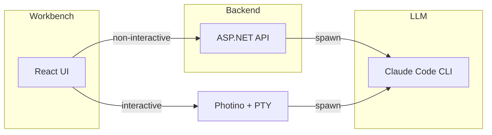

<!-- mill-context-hash: 7b627f98290564254baac652eb990e0870e3f826 -->
# Project Context

## Summary

mill is a specification-first AI delivery system that transforms user intent into verified deliverables. It operates through four workspaces: Ground (product knowledge), Brief (ideas with intent), Shape (spec elicitation), and Ship (bounded execution loops). The primary interface is a Photino desktop app with a React frontend and ASP.NET backend.

This is a monorepo with three main components:
- **workbench/** — React 19 UI (Vite, Tailwind CSS 4, Zustand)
- **api/** — ASP.NET Minimal API (.NET 10, Markdig)
- **cli/** — Deprecated CLI tool (Photino.NET + Pty.Net host)

## Architecture

### Layers

- **Endpoints** (`api/Endpoints/`) — HTTP API surface (Minimal API route groups)
- **Services** (`api/Services/`) — Domain logic (BriefService, DraftService, GroundService, IssueService, ShipService, JobService, ObservationService)
- **Providers** (`api/Services/Providers/`) — LLM and issue provider abstractions
- **Workbench** (`workbench/src/`) — React UI with workspace components, stores, runtime abstraction

### Entry Points

- `api/ApiExtensions.cs` — API bootstrap, endpoint registration
- `workbench/src/main.tsx` — React app entry
- `workbench/src/App.tsx` — Root component, workspace routing
- `cli/Program.cs` — Deprecated CLI entry (Photino host)

### Key Abstractions

- `ILlmProvider` at `api/Services/Providers/ILlmProvider.cs:9` — LLM execution contract (Execute, SpawnInteractive, IsAvailable)
- `ClaudeCodeProvider` at `api/Services/Providers/ClaudeCodeProvider.cs:10` — Claude Code CLI implementation
- `IIssueProvider` at `api/Services/Providers/IIssueProvider.cs` — Issue tracker abstraction (GitHub, GitLab)
- `JobService` at `api/Services/JobService.cs:11` — Background job queues with SSE events (LLM + Ship queues)
- `Runtime` at `workbench/src/lib/runtime/index.ts` — Frontend LLM runtime abstraction (mock, pty, api modes)

### Data Flow

- **Non-interactive:** React UI → fetch → API endpoint → service → `ClaudeCodeProvider.Execute()` (spawns `claude --print`) → structured `LlmResponse`
- **Interactive:** React UI → Photino IPC / HTTP+SSE → `PtyManager` → Pty.Net spawns Claude CLI → xterm.js renders terminal
- **Jobs:** UI creates job → `JobService.Enqueue()` → Channel-based queue → worker processes (LLM or Ship) → SSE events to UI
- **Issues:** `IssueService` → `IIssueProvider` (GitHub via `gh` CLI or GitLab API)

### LLM Runtime Modes

| Mode | Path | Use Cases |
|------|------|-----------|
| Non-interactive | API → ClaudeCodeProvider → `claude --print` | Context warmup, verification, observations, autopick |
| Interactive | Photino + Pty.Net + xterm.js | Spec elicitation, work loops with user input |

## Recent Changes

| Commit | Description |
|--------|-------------|
| 7b627f9 | docs(shape): recommend Edit tool for incremental draft updates |
| 48f601a | feat(shape): use AskUserQuestion for final approval gate |
| 17ce7d6 | feat(shape): use AskUserQuestion for structured elicitation |
| 618b166 | feat(shape): add draft publish to GitHub issue |
| 251aa34 | fix(pty): resolve word echo and argument parsing bugs in PTY sessions |
| 805444c | fix(shape): block specs with open questions from becoming issues |
| 40c1a13 | fix(shape): add step 0 to check Resume Mode before codebase warmup |
| e954957 | fix(pty): load full draft content for interactive refine sessions |
| 820c106 | fix(shape): correct draft path from .mill/drafts to .mill/shape/drafts |
| 4980014 | feat(terminal): add copy/paste keyboard shortcuts |
| 1d67678 | fix(pty): resolve prompt paths from MILL_HOME instead of cwd |
| 2d0a30d | update workbench screenshot |
| 037c008 | fix(cli): traverse up from binary to find MILL_HOME in dev mode |
| 67d9f5b | fix(cli): update prompt paths from run/ to ship/ |
| 951cb0a | debug(ship): add logging for CLI output to debug signal parsing |
| e35dcf5 | fix(ship): disable MCP servers for non-interactive CLI calls |
| ddb6227 | feat(ship): add iteration tracking and stderr streaming for progress |
| 4a94b11 | fix(ship): show live elapsed time for running jobs |
| 7577dbb | feat(ship): improve run progress reporting and timeout handling |
| 913ade0 | feat(ship): add View button to navigate to running jobs |

## Tech Stack

### Backend (api/)
- .NET 10 (net10.0)
- ASP.NET Minimal API
- Markdig (markdown parsing/rendering)
- System.Threading.Channels (job queues)
- Provider pattern for LLM and issue tracker abstraction

### Frontend (workbench/)
- React 19.2
- TypeScript 5.9
- Vite 7.2
- Tailwind CSS 4
- Zustand (state management)
- Radix UI primitives
- Lucide icons
- xterm.js (terminal rendering)

### Desktop
- Photino.NET (native webview)
- Pty.Net (cross-platform PTY)

## Key Files

| File | Purpose |
|------|---------|
| `AGENTS.md` | Project instructions (source of truth) |
| `api/Models/Models.cs` | All API data models |
| `api/Endpoints/SpecEndpoints.cs` | Draft and issue endpoints |
| `api/Endpoints/GroundEndpoints.cs` | Ground knowledge + observations |
| `api/Endpoints/RunEndpoints.cs` | Ship run management |
| `api/Endpoints/JobEndpoints.cs` | Job queue endpoints |
| `api/Services/JobService.cs` | Background job orchestration |
| `api/Services/ShipService.cs` | Ship run execution logic |
| `api/Services/DraftService.cs` | Spec draft management |
| `api/Services/Providers/ClaudeCodeProvider.cs` | Claude CLI integration |
| `workbench/src/App.tsx` | Root UI, workspace routing |
| `workbench/src/types/index.ts` | Frontend type definitions |
| `workbench/src/lib/api.ts` | API client |
| `workbench/src/stores/jobs.ts` | Job queue state |
| `shape/prompts/spec-draft.md` | Interactive spec elicitation prompt |
| `ship/prompts/loop-iterate.md` | Work loop prompt |
| `ship/prompts/loop-verify.md` | Verification prompt |

---
*Updated: 2026-04-03T12:00:00Z*
