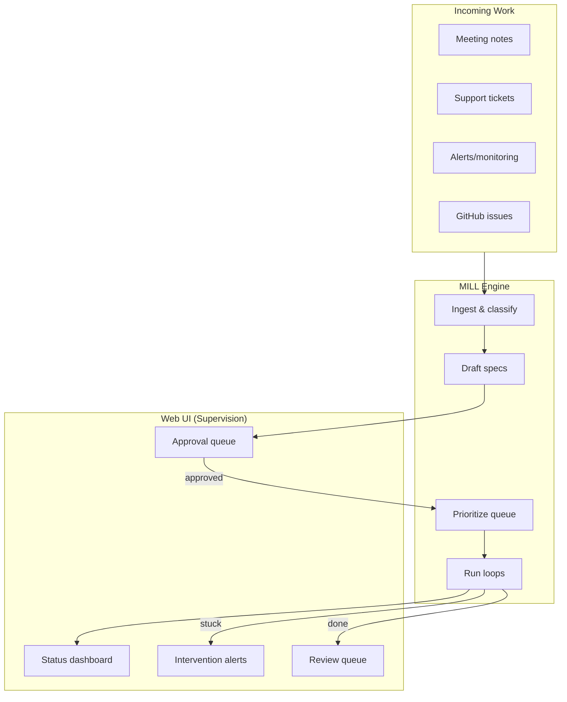
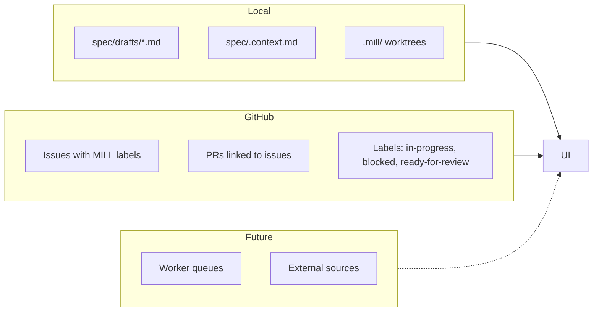

# MILL Web UI

> Supervision dashboard for autonomous spec-to-delivery workflows

## Status
Draft

---

## Decisions

| Question | Decision | Rationale |
|----------|----------|-----------|
| Non-MILL repo | Error with hint | "Run `mill init` first" - strict, clear |
| Loop tracking | PID + status.json per worktree | Multiple concurrent loops, detect crashes |
| Actions in UI | Read-only | All mutations via CLI (autonomous path) |
| Server lifecycle | Foreground | Dies on Ctrl+C - simple, explicit |
| Visual style | Minimal/terminal | Monospace, dark - matches CLI aesthetic |
| Issue scope | MILL-labeled only | feature, bug, security, task labels |
| Offline mode | Graceful degrade | Show drafts, issues section shows "offline" |
| Port conflict | Find next | Try 3143, 3144... - convenient |
| API design | Minimal | Just what UI needs, change freely |
| Refresh strategy | WebSocket + cache | Push local changes, cache GitHub 60s |
| Spec viewer | Read-only | "Open in Editor" for edits |
| Mobile support | Desktop only | Supervision happens at desk |
| Shared UI | One server per repo via `.mill/ui.active` | Multiple terminals share same UI |

---

## Vision

MILL evolves from human-driven to fully autonomous. The UI exists to **supervise**, not **operate**.



### Human Role Shift

| Phase | Human Does | MILL Does |
|-------|-----------|-----------|
| Today | Creates specs, triggers loops | Executes, verifies |
| Tomorrow | Approves specs, reviews PRs | Drafts specs, runs loops |
| Future | Sets policies, handles exceptions | Everything else |

### UI Principles

1. **Supervision over control** — show status, don't require interaction
2. **Approval gates** — humans approve specs before execution
3. **Exception handling** — surface only what needs attention
4. **Aggregation** — single view across local + GitHub + future sources

---

## Context

### Problem

MILL currently has no visibility layer. Users must:
- Manually check `spec/drafts/` for local work
- Query GitHub for issue status
- Watch terminal output for loop progress
- Remember what's running where

As MILL becomes autonomous, this becomes untenable. You can't supervise what you can't see.

### Users

- **Developer** — wants to see what MILL is working on, approve specs, review PRs
- **Tech Lead** — wants overview of all in-flight work, intervention when stuck
- **Future: Team** — shared visibility into autonomous work across repos

### Value

- Visibility into autonomous operations
- Approval workflow for auto-generated specs
- Early warning when loops need intervention
- Foundation for multi-source ingestion (meetings, tickets, etc.)

---

## Architecture

### Entry Point

```bash
$ mill
  > mill ui: http://localhost:3142
  > press ctrl+c to stop

# If port in use (other app):
$ mill
  > mill ui: http://localhost:3143

# If UI already running (same repo):
$ mill
  > mill ui already running: http://localhost:3142
  > opening browser...

# If not initialized:
$ mill
  x not a mill repo (run `mill init` first)
```

- `mill` with no arguments starts UI server and opens browser
- Server runs in foreground, dies on Ctrl+C
- Tries ports 3142, 3143, 3144... until one is free
- Requires `spec/` directory (MILL-initialized repo)
- **If server already running** (same repo): opens browser to existing URL, exits
  - Detects via `.mill/ui.active` (contains port number)

### Tech Stack

| Component | Choice | Rationale |
|-----------|--------|-----------|
| Server | .NET (extend existing CLI) | Single binary, no new runtime |
| Frontend | Static HTML + Alpine.js | Minimal JS, terminal aesthetic |
| Data | GitHub API + local filesystem | No database, stateless |
| Real-time | WebSocket (local) + cache (GitHub) | Reactive local, rate-limit safe |
| Style | Dark, monospace | Matches CLI aesthetic |

### Data Sources



---

## MVP v1: Scope

### In Scope

1. **Dashboard view**
   - Local drafts from `spec/drafts/`
   - GitHub issues with MILL labels (feature, bug, security, task)
   - Status badges (open, in-progress, blocked, ready-for-review, closed)

2. **Spec viewer**
   - Click draft/issue → rendered markdown
   - Read-only (editing happens in editor)

3. **Quick actions**
   - "Open in GitHub" for issues/PRs
   - "Open in Editor" for local drafts
   - No issue creation from UI (use `mill model` CLI)

4. **Loop status** (if running)
   - Current iteration / max
   - Time elapsed
   - Last activity

### Out of Scope (v1)

- Approval queue (requires auto-generated specs, not built yet)
- Notifications (email, Slack, desktop)
- Multi-repo aggregation
- Meeting notes / ticket ingestion
- Terminal-in-browser / conversational UI
- Editing specs in browser (read-only viewer)
- Mobile/responsive layout

### Dependencies

- `gh` CLI authenticated
- Git repository with MILL initialized

---

## User Stories

### Primary Story
As a developer, I want to see all MILL work (drafts + issues) in one place so that I know what's pending, running, and ready for review.

### Additional Stories

- As a developer, I want to view rendered specs without leaving the dashboard so that I can quickly review content.
- As a developer, I want to see loop progress so that I know if something is stuck.
- As a tech lead, I want status visibility across the project so that I can identify bottlenecks.

---

## Acceptance Criteria

### Core Criteria

1. **Dashboard loads**
   - Given: MILL-initialized repo
   - When: User runs `mill` (no args)
   - Then: Browser opens to dashboard showing drafts and issues

2. **Drafts displayed**
   - Given: Files exist in `spec/drafts/`
   - When: Dashboard loads
   - Then: All `.md` files shown with filename and last modified

3. **Issues displayed**
   - Given: GitHub issues exist with MILL labels
   - When: Dashboard loads
   - Then: Issues shown grouped by status label

4. **Spec viewer works**
   - Given: Dashboard is open
   - When: User clicks a draft or issue
   - Then: Rendered markdown displayed in detail pane

### Edge Cases

- No drafts exist → show empty state with hint
- No GitHub issues → show empty state
- `gh` not authenticated → issues section shows "offline" with hint
- GitHub API fails → issues section shows "offline", drafts still work
- Loop running in background → show status even if started from CLI
- Multiple loops running → show all with individual status
- Loop crashed (dead pid) → show as crashed (retry via CLI)
- Port 3142 in use (other app) → try 3143, 3144, etc.
- UI already running (same repo) → open existing URL, don't start second server
- Not a MILL repo → error: "Run `mill init` first"

---

## UI Wireframe

```
┌─────────────────────────────────────────────────────────────────┐
│ MILL · project-name                                 [Refresh]   │
├───────────────────────┬─────────────────────────────────────────┤
│                       │                                         │
│  DRAFTS (3)           │  ## Feature: Auth Timeout               │
│  ─────────────────    │                                         │
│  ● auth-timeout       │  > Session timeout with warning         │
│    api-refactor       │                                         │
│    dark-mode          │  ### Problem                            │
│                       │  Users get logged out without...        │
│  ISSUES               │                                         │
│  ─────────────────    │  ### User Stories                       │
│                       │  - As a user, I want...                 │
│  🔄 In Progress (1)   │                                         │
│    #42 Auth timeout   │                                         │
│        iter 12/20     │                                         │
│                       │  ─────────────────────────────────────  │
│  ⏸ Blocked (0)        │                                         │
│                       │  [Open in Editor]  [Open in GitHub]     │
│  ✅ Ready (2)         │                                         │
│    #38 API refactor   │                                         │
│    #41 Error handling │                                         │
│                       │                                         │
│  ● Open (1)           │                                         │
│    #50 Dark mode      │                                         │
│                       │                                         │
└───────────────────────┴─────────────────────────────────────────┘
```

---

## Future: v2+ Features

### Approval Queue
When MILL auto-generates specs, they appear in an "Awaiting Approval" section:

```
⏳ AWAITING APPROVAL (2)
─────────────────────────
📝 "Auth timeout" - from standup notes
   [View] [Approve] [Edit] [Reject]

📝 "Fix redirect bug" - from support #892
   [View] [Approve] [Edit] [Reject]
```

### Intervention Alerts
When loops need help:

```
⚠️ NEEDS ATTENTION (1)
─────────────────────────
#48 Cache invalidation
    Stuck at 20/20 iterations
    → mill loop #48 --retry
```

### Notifications
- Desktop notifications for: approval needed, loop stuck, PR ready
- Optional: Slack/email integration

### Multi-Repo
- Register multiple repos in `~/.mill/projects.json`
- Aggregated dashboard across all projects
- Repo switcher in header

### Ingestion Sources
- Slack channel monitoring
- Email inbox parsing
- Calendar/meeting notes
- Monitoring alerts
- Manual "inbox" for pasting content

---

## Verification

### Automated Tests
- [ ] Server starts on `mill` command
- [ ] Dashboard renders without errors
- [ ] Drafts loaded from filesystem
- [ ] Issues fetched from GitHub API
- [ ] Spec viewer renders markdown

### Manual Verification
- [ ] Browser opens automatically
- [ ] Clicking draft shows content
- [ ] Clicking issue shows content
- [ ] "Open in Editor" opens file
- [ ] "Open in GitHub" opens issue URL
- [ ] Loop status shown when running

### Verification Commands
```bash
# Start UI
mill

# In another terminal, verify server responds
curl -s http://localhost:3142 | grep -q "MILL"

# Verify drafts endpoint
curl -s http://localhost:3142/api/drafts | jq .

# Verify issues endpoint
curl -s http://localhost:3142/api/issues | jq .
```

---

## Loop Contract

- **Success Criteria:** All acceptance criteria pass; UI functional for single repo
- **Completion Promise:** `MILL_DONE`
- **Verification Commands:** See above
- **Stop Conditions:** 20 iterations or blocking dependency
- **Rollback Strategy:** Feature flag or separate `mill ui` command

---

## Implementation Notes

### Server Structure

```
cli/
├── Program.cs              # Add UI command handling
├── Ui/
│   ├── UiServer.cs         # Kestrel setup, port finding
│   ├── WebSocketHandler.cs # Push notifications to browser
│   ├── FileWatcher.cs      # Watch spec/drafts/ and .mill/
│   ├── GitHubCache.cs      # Cached issue fetching (60s TTL)
│   └── Api/
│       ├── DraftsApi.cs    # GET /api/drafts
│       ├── IssuesApi.cs    # GET /api/issues
│       ├── LoopsApi.cs     # GET /api/loops
│       └── SpecApi.cs      # GET /api/spec/:id (render md)
└── wwwroot/
    ├── index.html          # Dashboard (dark, monospace)
    ├── app.js              # Alpine.js + WebSocket client
    └── styles.css          # Terminal aesthetic
```

### API Endpoints

| Endpoint | Method | Returns |
|----------|--------|---------|
| `/` | GET | Dashboard HTML |
| `/ws` | WebSocket | Push updates (drafts, loop status) |
| `/api/drafts` | GET | `[{name, path, modified}]` |
| `/api/issues` | GET | `[{number, title, labels, state}]` (cached 60s) |
| `/api/loops` | GET | `[{issue, iteration, max, status}]` (status: running/crashed/done) |
| `/api/spec/draft/:name` | GET | Rendered markdown HTML |
| `/api/spec/issue/:number` | GET | Rendered issue body HTML |

### WebSocket Messages

```json
// Server → Browser
{"type": "drafts", "data": [...]}
{"type": "loops", "data": [{issue, iteration, max, status}, ...]}

// Browser sends nothing (read-only)
```

### Real-time Strategy

```mermaid
flowchart LR
    subgraph Server
        FSW[FileSystemWatcher] -->|change| WS[WebSocket]
        GH[GitHub API] -->|60s cache| API[/api/issues]
    end

    subgraph Browser
        WS -->|push| UI[Update immediately]
        API -->|on load + manual| UI
    end
```

- **Local drafts**: FileSystemWatcher triggers WebSocket push
- **GitHub issues**: Cached 60s, refresh on page load or manual click
- **Loop status**: Read from `.mill/loop.status.json`, pushed via WebSocket

### Loop Tracking (Multi-Loop)

Multiple loops can run concurrently (different issues, same repo). Each loop writes to its worktree:

```
.mill/
├── ui.active               # UI server presence (contains port)
├── issue-42/
│   ├── loop.pid          # Process ID
│   └── loop.status.json  # State
├── issue-45/
│   ├── loop.pid
│   └── loop.status.json
└── issue-47/
    └── (no pid = not running, leftover worktree)
```

```json
{
  "issue": 42,
  "started": "2025-01-18T14:32:00Z",
  "iteration": 12,
  "maxIterations": 20,
  "lastActivity": "2025-01-18T14:45:00Z"
}
```

**Detection logic:**
1. Scan `.mill/issue-*/` directories
2. For each, check if `loop.pid` exists
3. If exists, `kill -0 $pid` to verify alive
4. If alive, read `loop.status.json` for details
5. If dead pid, show as "crashed" with retry option

**UI shows all active loops:**
```
🔄 In Progress (2)
  #42 Auth timeout     ██████░░░░ 12/20
  #45 API refactor     ██░░░░░░░░  4/20

⚠️ Crashed (1)
  #47 Dark mode        stopped at 8/20
      → mill loop #47 --retry
```

---

*Built from intent with MILL*
