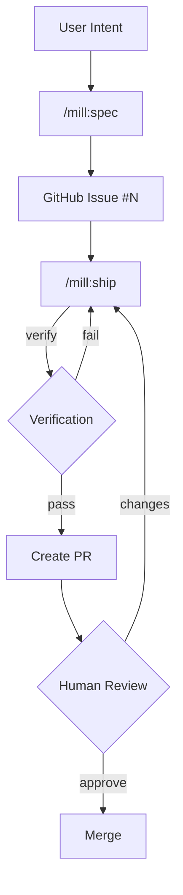

# mill

Turning intent into verified deliverables, continuously.

> **Branding:** Always "mill" in lowercase. Never "MILL" or "Mill".

## Overview

mill is a specification-first delivery system that integrates with Claude Code as a skill pack. It provides structure and intelligence for the entire delivery workflow — pure skills, no CLI binary.

## Architecture

```
mill/                           # Main repository (source of truth)
├── skills/                     # Skill source files → synced to claude-plugins
└── templates/                  # Archetypes, stacks, specs, domains, teammates

claude-plugins/                 # Distribution repository (auto-synced)
├── .claude-plugin/             # Plugin manifest + marketplace
├── skills/                     # Skills for Claude Code
└── templates/                  # Templates copied during /mill:init
```

## Skills

| Skill | Purpose |
|-------|---------|
| `/mill:init` | Initialize `.mill/` in a project |
| `/mill:ground` | Define who you build for and how |
| `/mill:idea` | Capture a rough idea (30-day lifecycle) |
| `/mill:spec` | Turn intent into a precise, complete spec |
| `/mill:ship` | Assemble a team, implement a spec → Pull Request |
| `/mill:warmup` | Orient Claude to your codebase |

Skills use Claude Code's native tools (Read, Write, Glob, Grep, Bash) for all file operations. No external binary needed.

## Domains

Specs include a `domain` field that determines execution guidance:

| Domain | Focus | Guidance |
|--------|-------|----------|
| `backend` | APIs, services, data | API design, error handling, performance |
| `application` | Interactive apps | Component architecture, state, UX |
| `website` | Pages (landing, marketing) | Aesthetics, responsive, performance |
| `platform` | Infrastructure, orchestration | IaC, containers, reliability, observability |
| `fullstack` | Multiple layers | Combined guidance |

Domain templates live in `templates/domains/` and are loaded by `/mill:ship` during execution.

## Observations

Observations is the **learning inbox** for mill. Skills write observations during execution. `/mill:ground` reviews and curates them into ground truth.

```
Skills (spec, ship, ground)
        │
        ▼ write .md files directly
.mill/observations/*.md
        │
        ▼ review via /mill:ground (AskUserQuestion)
.mill/ground/* (curated truth)
```

| Observation Type | Meaning |
|------------------|---------|
| `extraction` | Auto-extracted from code (dependencies, entities) |
| `discovery` | New information found (unknown persona, new term) |
| `concern` | Potential problem (missing tests, code smell) |
| `suggestion` | Improvement idea (refactoring opportunity) |

This continuous feedback loop is what sets mill apart — the system learns as you ship.

## Spec Structure

Specs link **what** → **how** → **proof**:

```
Requirements (R)     → what the solution must achieve
        ↓ implemented by
Approach (A)         → how we'll build it (parts + mechanisms)
        ↓ verified by
Criteria (C)         → testable conditions
```

**Coverage (R x A x C)** proves the chain: requirements have approach parts, and criteria verify them.

## Workflow



## Ship: Agent Teams

`/mill:ship` uses an "always a team" model:

1. **Lead** (the skill session) — orchestrates, never implements directly
2. **Implementer(s)** — 1-4 agents, each with file ownership boundaries
3. **Verifier** — separate agent with clean context, checks spec criteria independently

Even simple specs get a team-of-1 implementer + 1 verifier. The verifier never sees implementer reasoning — structural independence ensures genuine review.

Falls back to single-session mode if agent teams aren't available.

## Project Structure

```
.mill/                              # Target repo's mill folder
├── project.json                    # Global config
├── context.md                      # Auto-generated project context

├── observations/                   # Learning inbox [gitignored]
│   └── *.md                        # Written by skills during execution

├── ground/                         # Shared product knowledge (10 categories)
│   ├── strategic/                  # Vision, mission, goals
│   ├── personas/                   # Who you build for
│   ├── rules/                      # Constraints and conventions
│   ├── decisions/                  # Architectural decisions
│   ├── vocabulary/                 # Domain terminology
│   ├── stack/                      # Technology stack
│   ├── schema/                     # Data structures
│   ├── design/                     # Visual language
│   ├── patterns/                   # Code patterns
│   └── debt/                       # Technical debt

├── idea/
│   └── active/                     # Live briefs [gitignored]

├── spec/
│   └── drafts/                     # Specs before publishing [gitignored]

├── templates/                      # Copied from plugin during /mill:init
│   ├── archetypes/
│   ├── stacks/
│   ├── specs/
│   ├── domains/
│   └── teammates/

└── ship/
    ├── work/                       # Worktrees [gitignored]
    └── history.json                # Completed runs

# Published specs live in GitHub Issues (source of truth)
```

## Requirements

- Claude Code
- `gh` CLI (GitHub CLI) — authenticated
- Git repository

## First Run

When you first use mill skills in a project, Claude Code will prompt for permission to run `gh` and `git` commands. Select **"Yes, and don't ask again"** to approve these commands permanently for the project. After this one-time approval, skills run smoothly without interruption.

## Installation

Install via Claude Code plugin:

```
/plugin marketplace add mindrevolution/claude-plugins
/plugin install mill@mindrevolution
```

Then initialize in your project:

```
/mill:init
```

## Plugin Sync

The `claude-plugins` repo is auto-synced from `mill` on each release:

1. Release published on `mill` repo
2. GitHub Action (`sync-plugin.yml`) triggers
3. Copies `skills/`, `templates/`, `.claude-plugin/` to `claude-plugins`
4. Users get updates via plugin auto-update

## Development

Skills are markdown files in `skills/`. Templates are in `templates/`. Edit and test directly — no build step.

## Key Principles

1. **Specs drive execution** — GitHub Issues are source of truth
2. **Contracts over conversation** — No "done" without verification
3. **Team-based delivery** — Lead orchestrates, implementers build, verifier checks
4. **Skills over CLI** — LLM-native tools, no binary dependencies
5. **Humans drive direction** — AI improves the code
