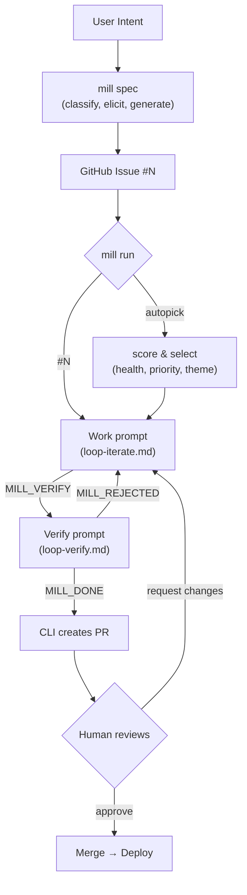

# MILL

Turning intent into verified deliverables, continuously.

## Overview

MILL is a specification-first delivery system with two main workflows:

1. **Spec Process** — Chat-to-spec: Transform user intent into complete, loop-ready specifications
2. **Work Loop** — Ralph-style execution: Bounded iteration until verification passes

## Structure

```
mill/
├── cli/                    # .NET CLI source
│   └── Program.cs
├── bin/                    # Published binary
│   └── mill
├── spec/                   # Spec creation (prompts + templates)
│   ├── prompts/
│   │   ├── context-warmup.md   # Generates .mill/context.md
│   │   ├── spec-draft.md       # Interactive spec elicitation
│   │   └── spec-refine.md      # Update spec against current codebase
│   └── templates/              # Spec output templates
│       ├── feature.md
│       ├── bug.md
│       ├── security.md
│       └── task.md
├── run/                    # Iterative execution
│   └── prompts/
│       ├── loop-iterate.md         # Work prompt (implement, signal MILL_VERIFY)
│       ├── loop-verify.md          # Verify prompt (review, approve/reject)
│       ├── loop-verify-criterion.md # Parallel: verify one criterion
│       └── run-autopick.md         # Intelligent issue selection
└── README.md

.mill/                      # Target repo's MILL folder
├── config.json             # Project configuration (scoring, excludes)
├── context.md              # Auto-generated project context
├── memory/                 # Machine-generated learnings
│   └── project.md
├── drafts/                 # In-progress specs (local, resumable)
│   └── {slug}.md
├── standards/              # Human-authored rules
└── work/                   # Worktrees (gitignored, ephemeral)

# Completed specs live in GitHub Issues (single source of truth)
```

## Prompt File Naming

Format: `[subject]-[verb].md`

| File | Subject | Verb | Purpose |
|------|---------|------|---------|
| `context-warmup.md` | context | warmup | Build project context |
| `spec-draft.md` | spec | draft | Interactive spec elicitation with persistence |
| `spec-refine.md` | spec | refine | Update spec against current codebase |
| `loop-iterate.md` | loop | iterate | Work prompt — implement slice, signal MILL_VERIFY |
| `loop-verify.md` | loop | verify | Verify prompt — review work, approve or reject |
| `loop-verify-criterion.md` | loop | verify-criterion | Parallel verification — check one criterion |
| `run-autopick.md` | run | autopick | Intelligent issue selection |

Templates use noun form: `feature.md`, `bug.md`, `security.md`, `task.md`

## Quick Start

```bash
# spec creation (interactive) → creates GitHub issue
mill spec

# refine existing spec against current codebase
mill spec 42

# list available issues
mill run

# autopick best issue (option 0)
mill run --auto

# work specific issue
mill run 42
```

## Intent Types

| Type | Use When | Key Fields |
|------|----------|------------|
| **Feature** | New behavior or capability | User stories, acceptance criteria, scope |
| **Bug** | Existing behavior is broken | Reproduction steps, expected vs actual, regression test |
| **Security** | Risk, vulnerability, compliance | STRIDE category, attack vector, mitigation |
| **Task** | Technical work, no user-facing change | Rationale, scope, regression guardrails |

## Workflow



### Two-Prompt Verification

Work and verification are separated into distinct prompts:

1. **Work prompt** (`loop-iterate.md`) — Implements the slice, runs tests, signals `MILL_VERIFY` with metadata
2. **Verify prompt** (`loop-verify.md`) — Independent principal-engineer review, runs tests again, checks criteria, signals `MILL_DONE` or `MILL_REJECTED`

Only the verify prompt can authorize completion. The work prompt cannot grade its own homework.

### Criterion-Based Verification

Verification runs one agent per acceptance criterion:

1. **CLI runs tests once** (gate before criterion checks)
2. **Agents verify criteria in parallel** (up to 4 concurrent)
3. **Results aggregated** → `MILL_DONE` or `MILL_REJECTED` with specific failures

Benefits:
- Faster verification for complex specs
- Granular feedback (know exactly which criterion failed)
- Multiple independent reviewers strengthen "can't grade own homework"

**Note:** Specs without parseable criteria skip verification with a warning — fix the spec to include structured acceptance criteria.

## Requirements

- `mill` binary in PATH (build with `./publish.sh`)
- `MILL_CLI` env var (default: `claude`)
- `gh` CLI (GitHub CLI) — authenticated
- Git repository

## Key Principles

1. **Model is source of truth** — Specs drive execution, not conversation
2. **Contracts over conversation** — No "done" without verification; work can't grade its own homework
3. **Limits are mandatory** — Bounded work prevents runaway loops
4. **Learning is explicit** — Memory improves the model, not the agent
5. **Hybrid worktree inheritance** — Config and standards are shared from parent; context and memory are per-worktree (rebuilt only if stale)
6. **Humans drive product direction** — Humans decide what gets built and when it ships; AI improves the code

## Development Notes

- **Do not run `dotnet publish`** after each change — the user will build periodically when needed

## Documentation Standards

- **Diagrams must use Mermaid** — no ASCII art. Use fenced code blocks with `mermaid` language identifier.
- Keep markdown files concise and scannable

## CLI Output Style

Minimal, uniform, lowercase messages.

**Design:** Progress indicators (`•`) are subtle gray; status symbols use color to convey meaning at a glance.

| Method | Symbol | Color | Use |
|--------|--------|-------|-----|
| `Out.Step(msg)` | `•` | Gray | action in progress (subtle) |
| `Out.Ok(msg)` | `✓` | Green | success, completion |
| `Out.Warn(msg)` | `▲` | Yellow | warnings, non-fatal issues |
| `Out.Error(msg)` | `✕` | Red | errors (stderr) |
| `Out.Detail(msg)` | `↳` | Gray | sub-item, additional info |
| `Out.Prompt(msg)` | `❯` | Blink | awaiting user input |
| `Out.Confirm(msg)` | `❯` | Blink | y/n single-keypress confirmation |
| `Out.Line()` | `---` | | separator |
| `Out.Blank()` | | | empty line |

Example output:
```
  • verifying git repo...
  ✓ git repo
  • verifying gh auth...
  ✓ gh authenticated
  ▲ context stale
    ↳ uncommitted changes read on demand
```
