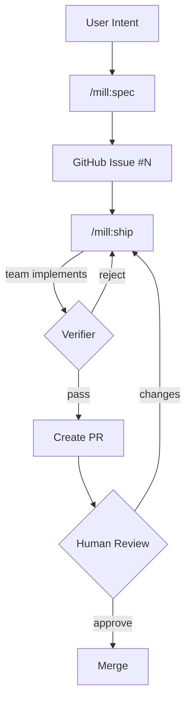

# mill

Turning intent into verified deliverables, continuously.

> **Branding:** Always "mill" in lowercase. Never "MILL" or "Mill".

## Overview

mill is a skill pack for Claude Code. Markdown skills orchestrate Claude Code's native tools (Read, Write, Glob, Grep, Bash) to manage the full delivery workflow: knowledge capture, spec drafting, team-based implementation, and independent verification.

## Architecture

```
mill/
├── .claude-plugin/
│   └── marketplace.json        # Plugin marketplace discovery (source: "./plugin")
├── plugin/                     # Plugin distribution root (cached on install)
│   ├── .claude-plugin/
│   │   └── plugin.json         # Plugin manifest
│   └── skills/                 # Skills (SKILL.md + supporting files)
│       ├── ship/
│       │   ├── SKILL.md
│       │   └── templates/      # Teammates, domain guidance
│       ├── spec/
│       │   ├── SKILL.md
│       │   └── templates/      # Spec type templates
│       └── {init,ground,idea,warmup}/
│           └── SKILL.md
├── manual/                     # Documentation site (Astro)
└── AGENTS.md
```

## Skills

| Skill | Purpose | Tools Used |
|-------|---------|------------|
| `/mill:init` | Initialize `.mill/` in a project | Bash, Write, Glob, Read |
| `/mill:ground` | Build and curate product knowledge | Glob, Read, Write, Bash(rm, git) |
| `/mill:idea` | Capture ideas with 30-day lifecycle | Read, Write, Glob, Bash(rm) |
| `/mill:spec` | Draft specs, publish as GitHub Issues | Read, Write, Glob, Grep, Bash(gh, git, rm) |
| `/mill:ship` | Assemble team, implement, verify → PR | Read, Write, Edit, Glob, Grep, Bash(gh, git, rm, mkdir) |
| `/mill:warmup` | Orient Claude to your codebase | Read, Write, Glob, Grep, Bash(git) |

All file I/O, GitHub integration, and context checking happens through Claude Code's tools directly. Claude reads markdown natively — no intermediary format needed.

## Ship: Agent Teams

`/mill:ship` uses an "always a team" model. The skill session becomes the **lead** — it orchestrates but never implements directly.

### Team Composition

| Role | Count | Purpose |
|------|-------|---------|
| **Lead** | 1 | Reads spec, determines team size, assigns tasks, manages cross-team contracts |
| **Implementer** | 1-4 | Implements assigned tasks within explicit file ownership boundaries |
| **Verifier** | 1 | Reviews full changeset against spec criteria with clean context |

### How Team Size is Determined

Part count drives team size — no override based on coupling assessment:

| Approach Parts | Domain | Implementers |
|----------------|--------|-------------|
| 1–4 | Single | 1 |
| 5–9 | Single | 2 (split by concern) |
| Any | Fullstack | 2–3 (one per layer) |
| 10+ | Any | 3–4 |

### Polish Pass

After implementation completes, each implementer gets one bounded pass to polish and self-review before the verifier sees the code. Only polish code in the diff — don't refactor adjacent code. Simplify, improve naming, remove dead code, reduce nesting, clean dead comments. Behavior must not change. Check ground rules (naming, conventions, patterns). Then review against every spec criterion. This raises the floor for the verifier and reduces rejection cycles.

### Structural Independence

The verifier is always a separate agent that never sees the implementer's reasoning. This isn't a stylistic choice — it's the only way to get genuine review. Work can't grade its own homework.

### Iteration Loop

Ship uses the spec's **Loop Contract** to govern iteration cycles instead of a hardcoded limit.

Verifier rejects → lead builds cumulative iteration feedback (blockers, fixes attempted, what passed) → responsible implementer gets full history → implementer fixes → verifier re-checks with clean context (no iteration history). Cycles continue up to the Loop Contract's `max_iterations` (default 5), then escalate to the user with options to continue, PR as-is, or abort.

### Loop Contract

Every spec includes a Loop Contract that controls ship's iteration behavior:

| Field | Purpose | Default |
|-------|---------|---------|
| **Max Iterations** | Maximum implement→verify cycles before escalating | 5 |
| **Test Command** | Must pass before PR | Detected from project |
| **Verification Commands** | Additional checks run by implementer and verifier | None |
| **Success Criteria** | What "done" looks like | All acceptance criteria pass |

Ship parses the Loop Contract from the spec body and supports both `Max Iterations` and the legacy `Stop Conditions` field name.

### Fallback

If agent teams aren't available (experimental feature disabled), ship falls back to single-session mode: lead implements directly, then does an explicit self-review phase against the spec. Iteration limit still governed by Loop Contract (default 5). Degraded but functional.

## Domains

Specs include a `domain` field that loads execution guidance from the plugin's `templates/domains/`:

| Domain | Focus | Guidance |
|--------|-------|----------|
| `backend` | APIs, services, data | API design, error handling, performance |
| `application` | Interactive apps | Component architecture, state, UX |
| `website` | Pages (landing, marketing) | Aesthetics, responsive, performance |
| `platform` | Infrastructure, orchestration | IaC, containers, reliability, observability |
| `fullstack` | Multiple layers | Combined guidance |

## Observations

The **learning inbox**. Skills write observations during execution — discoveries, concerns, suggestions. Observations reach ground truth through three paths:

```
Skills (spec, ship, warmup)
        │
        ▼ write .md files
.mill/observations/*.md
        │
        ├──→ /mill:ground (dedicated review — human routes to ground)
        ├──→ /mill:spec pre-flight (count + nudge before drafting)
        └──→ /mill:ship auto-tag (suggested: routing hint for ground)
        │
        ▼
.mill/ground/* (curated truth)
```

| Type | Meaning |
|------|---------|
| `extraction` | Auto-extracted from code (dependencies, entities) |
| `discovery` | New information found (unknown persona, new term) |
| `concern` | Potential problem (missing tests, code smell) |
| `suggestion` | Improvement idea (refactoring opportunity) |
| `learning` | Process knowledge (debugging insights, file couplings, workarounds) |

## Spec Structure

Specs link **what** → **how** → **proof**:

```
Requirements (R)     → what the solution must achieve
        ↓ sharpened by
Forcing Questions    → narrowest wedge, demand evidence
        ↓ explored as
Approaches (A, B)    → alternative ways to build it (pick one)
        ↓ verified by
Criteria (C)         → testable conditions
        ↓ reviewed by
Spec Review          → scored self-review + independent subagent review
```

**Coverage (R x A x C)** proves the chain: every requirement has approach parts, and criteria verify them.

Feature and task specs require **alternative approaches** — at least two options with tradeoffs before the user picks one. Rejected approaches are preserved in "Alternatives Considered." Bug and security specs may skip alternatives.

Specs include a **Failure Modes** table (trigger → detection → response → recovery) proportional to complexity.

Before publishing, every spec goes through a **two-phase review**: a scored self-review (feasibility, completeness, scope discipline, testability, clarity — all must score ≥ 7) followed by an independent subagent review with clean context.

A spec that requires clarifying questions has failed. The bar: could someone unfamiliar implement this without asking the author anything?

## Workflow



## Project Structure

```
.mill/                              # Created by /mill:init
├── context.md                      # Auto-generated project context
│
├── ground/                         # Product knowledge (10 categories)
│   ├── strategic/                  # Vision, mission, goals
│   ├── personas/                   # Who you build for
│   ├── rules/                      # Constraints and conventions
│   ├── decisions/                  # Architectural decisions
│   ├── vocabulary/                 # Domain terminology
│   ├── stack/                      # Technology stack
│   ├── schema/                     # Data structures
│   ├── design/                     # Visual language
│   ├── patterns/                   # Code patterns
│   └── debt/                       # Technical debt
│
├── observations/                   # Learning inbox [gitignored]
├── idea/active/                    # Live idea briefs [gitignored]
├── spec/drafts/                    # Specs before publishing [gitignored]
│
└── ship/
    └── work/                       # Git worktrees [gitignored]
```

## Requirements

- Claude Code
- `gh` CLI (GitHub CLI) — authenticated
- Git repository

That's it.

## Installation

```
/plugin marketplace add mindrevolution/mill
/plugin install mill@mindrevolution
```

Then in your project:

```
/mill:init
```

## Development

Edit `plugin/commands/*.md` and `plugin/templates/**/*.md` directly. Test by running the skills in a project with `.mill/` initialized.

## Version Sync

Three files must stay in sync when bumping versions:

| File | Field | Example |
|------|-------|---------|
| `plugin/.claude-plugin/plugin.json` | `"version"` | `"0.7.0-beta"` |
| `manual/package.json` | `"version"` | `"0.7.0-beta"` |
| `manual/src/pages/index.astro` | Hero badge | `v0.7 beta` (minor only) |

## Key Principles

1. **Specs drive execution** — GitHub Issues are source of truth
2. **Contracts over conversation** — no "done" without independent verification
3. **Team-based delivery** — lead orchestrates, implementers build, verifier checks
4. **Pure skills** — markdown prompts orchestrating Claude Code's native tools
5. **Continuous learning** — every ship cycle feeds observations back into ground truth
