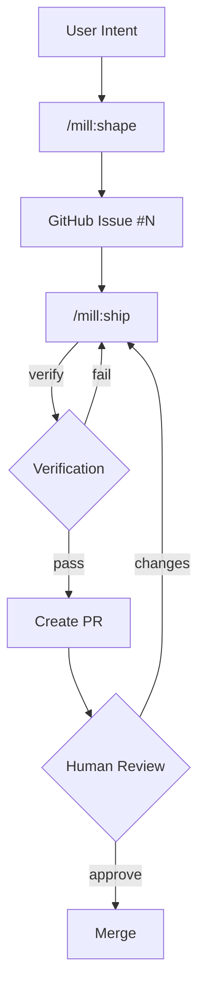

# mill

Turning intent into verified deliverables, continuously.

> **Branding:** Always "mill" in lowercase. Never "MILL" or "Mill".

## Overview

mill is a specification-first delivery system that integrates with Claude Code as a skill pack. It provides structure and intelligence for the entire delivery workflow.

### Two Components

1. **CLI** (`mill`) — Data operations, GitHub integration, structured output
2. **Skills** (`/mill:*`) — LLM-powered workflows invoked in Claude Code

## Architecture

```
~/.claude/skills/mill/          # Installed skills
├── ground.md                   # /mill:ground - knowledge management
├── brief.md                    # /mill:brief - idea capture
├── shape.md                    # /mill:shape - spec drafting
├── ship.md                     # /mill:ship - bounded work loops
├── warmup.md                   # /mill:warmup - codebase context
└── question.md                 # /mill:question - answer questions

mill/                           # Repository
├── cli/                        # .NET CLI
│   ├── Commands/               # Command implementations
│   └── Services/               # Shared logic
├── skills/                     # Skill source files
├── templates/                  # All templates
│   ├── specs/                  # Spec templates (feature, bug, security, task)
│   ├── archetypes/             # Product archetypes (saas, marketplace, etc.)
│   └── stacks/                 # Tech stack profiles
└── prompts/                    # LLM prompts (used by skills)
```

## CLI Commands

```bash
mill init                           # Initialize .mill/ in current repo
mill ground list|get|create         # Knowledge CRUD
mill brief list|get|create|drop     # Brief lifecycle
mill draft list|get|validate|publish # Draft management + GitHub publish
mill issue list|get                 # Wraps gh CLI
mill history [add]                  # Ship run history
mill context [show]                 # View context.md
mill template list|get              # Archetypes/stacks/templates
```

Output: JSON by default, `--human` for readable output.

## Skills

| Skill | Purpose |
|-------|---------|
| `/mill:ground` | Build product knowledge — personas, standards, concepts, design |
| `/mill:brief` | Capture ideas with 30-day lifecycle |
| `/mill:shape` | Transform intent into verified specs → GitHub Issues |
| `/mill:ship` | Execute bounded work loops until verification passes |
| `/mill:warmup` | Generate `.mill/context.md` from codebase |
| `/mill:question` | Answer questions without making changes |

## Workflow



## Project Structure

```
.mill/                              # Target repo's mill folder
├── project.json                    # Global config
├── context.md                      # Auto-generated project context

├── ground/                         # Shared product knowledge
│   ├── personas/                   # Who you build for
│   ├── standards/                  # How you build
│   ├── concepts/                   # Domain vocabulary
│   └── design/                     # Visual language

├── brief/
│   └── active/                     # Live briefs [gitignored]

├── shape/
│   └── drafts/                     # Specs before publishing [gitignored]

└── ship/
    ├── work/                       # Worktrees [gitignored]
    └── history.json                # Completed runs

# Published specs live in GitHub Issues (source of truth)
```

## Requirements

- Claude Code CLI
- `gh` CLI (GitHub CLI) — authenticated
- Git repository
- .NET 10 runtime (for CLI)

## Installation

### macOS / Linux

```bash
curl -fsSL https://raw.githubusercontent.com/mindrevolution/mill/main/install.sh | bash
```

### Windows

```powershell
irm https://raw.githubusercontent.com/mindrevolution/mill/main/install.ps1 | iex
```

### Manual

1. Download CLI binary from releases
2. Copy `skills/` to `~/.claude/skills/mill/`

## Development

```bash
# Build CLI
cd cli && dotnet build

# Run CLI
dotnet run -- --help
dotnet run -- init --human
dotnet run -- ground list --human
```

## Key Principles

1. **Specs drive execution** — GitHub Issues are source of truth
2. **Contracts over conversation** — No "done" without verification
3. **Bounded iterations** — Work in slices, verify after each
4. **Skills + CLI** — LLM for intelligence, CLI for structure
5. **Humans drive direction** — AI improves the code
