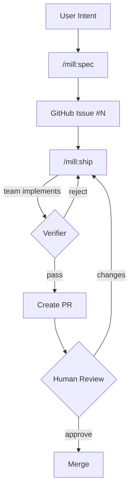

# mill

Turning intent into verified deliverables, continuously.

> **Branding:** Always "mill" in lowercase. Never "MILL" or "Mill".

## Overview

mill is a skill pack for Claude Code. Markdown skills orchestrate Claude Code's native tools (Read, Write, Glob, Grep, Bash) to manage the full delivery workflow: knowledge capture, spec drafting, team-based implementation, and independent verification.

## Architecture

```
mill/                           # Source of truth
├── skills/                     # Skill prompts (synced to plugin repo)
├── templates/                  # Archetypes, stacks, specs, domains, teammates
├── .claude-plugin/             # Plugin manifest for Claude Code
└── manual/                     # Documentation site (Astro)

claude-plugins/                 # Distribution repo (auto-synced on release)
├── .claude-plugin/             # Plugin manifest + marketplace
├── skills/                     # Skills for Claude Code
└── templates/                  # Copied to .mill/templates/ during /mill:init
```

## Skills

| Skill | Purpose | Tools Used |
|-------|---------|------------|
| `/mill:init` | Initialize `.mill/` in a project | Bash, Write, Glob, Read |
| `/mill:ground` | Build and curate product knowledge | Glob, Read, Write, Bash(rm, git) |
| `/mill:idea` | Capture ideas with 30-day lifecycle | Read, Write, Glob, Bash(rm) |
| `/mill:spec` | Draft specs, publish as GitHub Issues | Read, Write, Glob, Grep, Bash(gh, git, rm) |
| `/mill:ship` | Assemble team, implement, verify → PR | Read, Write, Edit, Glob, Grep, Bash(gh, git, rm, mkdir) |
| `/mill:warmup` | Orient Claude to your codebase | Read, Write, Glob, Grep, Bash(git) |

All file I/O, GitHub integration, context checking, and history tracking happens through Claude Code's tools directly. Claude reads markdown natively — no intermediary format needed.

## Ship: Agent Teams

`/mill:ship` uses an "always a team" model. The skill session becomes the **lead** — it orchestrates but never implements directly.

### Team Composition

| Role | Count | Purpose |
|------|-------|---------|
| **Lead** | 1 | Reads spec, determines team size, assigns tasks, manages cross-team contracts |
| **Implementer** | 1-4 | Implements assigned tasks within explicit file ownership boundaries |
| **Verifier** | 1 | Reviews full changeset against spec criteria with clean context |

### How Team Size is Determined

| Spec Shape | Implementers |
|------------|-------------|
| Single domain, 1-4 approach parts | 1 |
| Single domain, 5+ approach parts | 2 (split by concern) |
| Fullstack domain | 2-3 (one per layer) |
| Complex, 10+ parts | 3-4 |

### Structural Independence

The verifier is always a separate agent that never sees the implementer's reasoning. This isn't a stylistic choice — it's the only way to get genuine review. Work can't grade its own homework.

### Rejection Cycles

Verifier rejects → lead routes specific feedback to the responsible implementer → implementer fixes → verifier re-checks. Maximum 3 cycles before escalating to the user.

### Fallback

If agent teams aren't available (experimental feature disabled), ship falls back to single-session mode: lead implements directly, then does an explicit self-review phase against the spec. Degraded but functional.

## Domains

Specs include a `domain` field that loads execution guidance from `templates/domains/`:

| Domain | Focus | Guidance |
|--------|-------|----------|
| `backend` | APIs, services, data | API design, error handling, performance |
| `application` | Interactive apps | Component architecture, state, UX |
| `website` | Pages (landing, marketing) | Aesthetics, responsive, performance |
| `platform` | Infrastructure, orchestration | IaC, containers, reliability, observability |
| `fullstack` | Multiple layers | Combined guidance |

## Observations

The **learning inbox**. Skills write observations during execution — discoveries, concerns, suggestions. `/mill:ground` reviews and curates them into permanent ground truth.

```
Skills (spec, ship, warmup)
        │
        ▼ write .md files
.mill/observations/*.md
        │
        ▼ review via /mill:ground
.mill/ground/* (curated truth)
```

| Type | Meaning |
|------|---------|
| `extraction` | Auto-extracted from code (dependencies, entities) |
| `discovery` | New information found (unknown persona, new term) |
| `concern` | Potential problem (missing tests, code smell) |
| `suggestion` | Improvement idea (refactoring opportunity) |

## Spec Structure

Specs link **what** → **how** → **proof**:

```
Requirements (R)     → what the solution must achieve
        ↓ implemented by
Approach (A)         → how we'll build it (parts + mechanisms)
        ↓ verified by
Criteria (C)         → testable conditions
```

**Coverage (R x A x C)** proves the chain: every requirement has approach parts, and criteria verify them.

A spec that requires clarifying questions has failed. The bar: could someone unfamiliar implement this without asking the author anything?

## Workflow



## Project Structure

```
.mill/                              # Created by /mill:init
├── project.json                    # Config (test command, default branch)
├── context.md                      # Auto-generated project context
│
├── ground/                         # Product knowledge (10 categories)
│   ├── strategic/                  # Vision, mission, goals
│   ├── personas/                   # Who you build for
│   ├── rules/                      # Constraints and conventions
│   ├── decisions/                  # Architectural decisions
│   ├── vocabulary/                 # Domain terminology
│   ├── stack/                      # Technology stack
│   ├── schema/                     # Data structures
│   ├── design/                     # Visual language
│   ├── patterns/                   # Code patterns
│   └── debt/                       # Technical debt
│
├── observations/                   # Learning inbox [gitignored]
├── idea/active/                    # Live idea briefs [gitignored]
├── spec/drafts/                    # Specs before publishing [gitignored]
│
├── templates/                      # Copied from plugin during init
│   ├── archetypes/                 # Project archetypes (SaaS, API, mobile, etc.)
│   ├── stacks/                     # Technology stacks
│   ├── specs/                      # Spec templates (feature, bug, task, security)
│   ├── domains/                    # Domain execution guidance
│   └── teammates/                  # Implementer and verifier prompts
│
└── ship/
    ├── work/                       # Git worktrees [gitignored]
    └── history.json                # Completed ship runs
```

## Requirements

- Claude Code
- `gh` CLI (GitHub CLI) — authenticated
- Git repository

That's it.

## Installation

```
/plugin marketplace add mindrevolution/claude-plugins
/plugin install mill@mindrevolution
```

Then in your project:

```
/mill:init
```

## First Run

Claude Code will prompt for permission to run `gh` and `git` commands. Select **"Yes, and don't ask again"** for smooth operation.

## Plugin Sync

The `claude-plugins` repo is auto-synced from `mill` on each release:

1. Tag pushed on `mill` repo → GitHub release created
2. `sync-plugin.yml` copies `skills/`, `templates/`, `.claude-plugin/` to `claude-plugins`
3. Users get updates via plugin auto-update

## Development

Edit `skills/*.md` and `templates/**/*.md` directly. Test by running the skills in a project with `.mill/` initialized.

## Key Principles

1. **Specs drive execution** — GitHub Issues are source of truth
2. **Contracts over conversation** — no "done" without independent verification
3. **Team-based delivery** — lead orchestrates, implementers build, verifier checks
4. **Pure skills** — markdown prompts orchestrating Claude Code's native tools
5. **Continuous learning** — every ship cycle feeds observations back into ground truth
