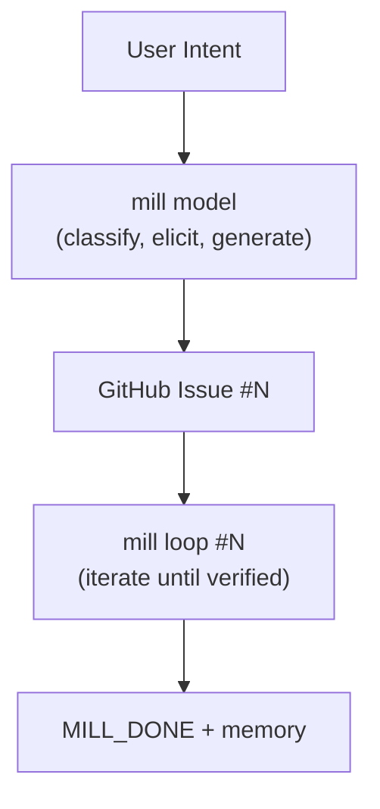

# MILL

Model-Driven · Iterative · Limit · Loop

## Overview

MILL is a specification-first delivery system with two main workflows:

1. **Spec Process** — Chat-to-spec: Transform user intent into complete, loop-ready specifications
2. **Work Loop** — Ralph-style execution: Bounded iteration until verification passes

## Structure

```
mill/
├── cli/                    # .NET CLI source
│   └── Program.cs
├── bin/                    # Published binary
│   └── mill
├── model/                  # Model creation (the M in MILL)
│   ├── prompts/
│   │   ├── context-warmup.md   # Generates spec/.context.md
│   │   └── spec-draft.md        # Interactive spec elicitation
│   └── templates/              # Spec output templates
│       ├── feature.md
│       ├── bug.md
│       ├── security.md
│       └── task.md
├── loop/                   # Iterative Limit Loop (the ILL in MILL)
│   └── prompts/
│       └── loop-iterate.md     # Single iteration prompt
└── README.md

spec/                       # Target repo's spec folder
├── .context.md             # Hidden — auto-generated project context
├── .memory/                # Hidden — machine-generated learnings
│   └── project.md
├── drafts/                 # In-progress specs (local, resumable)
│   └── {slug}.md
└── standards/              # Visible — human-authored rules

# Completed specs live in GitHub Issues (single source of truth)
```

## Prompt File Naming

Format: `[subject]-[verb].md`

| File | Subject | Verb | Purpose |
|------|---------|------|---------|
| `context-warmup.md` | context | warmup | Build project context |
| `spec-draft.md` | spec | draft | Interactive spec elicitation with persistence |
| `loop-iterate.md` | loop | iterate | Execute one iteration |

Templates use noun form: `feature.md`, `bug.md`, `security.md`, `task.md`

## Quick Start

```bash
# spec creation (interactive) → creates GitHub issue
mill model

# work loop (in worktree) → runs against issue
git worktree add .mill-sandbox HEAD
cd .mill-sandbox
mill loop #42
```

## Intent Types

| Type | Use When | Key Fields |
|------|----------|------------|
| **Feature** | New behavior or capability | User stories, acceptance criteria, scope |
| **Bug** | Existing behavior is broken | Reproduction steps, expected vs actual, regression test |
| **Security** | Risk, vulnerability, compliance | STRIDE category, attack vector, mitigation |
| **Task** | Technical work, no user-facing change | Rationale, scope, regression guardrails |

## Workflow



## Requirements

- `mill` binary in PATH (build with `./publish.sh`)
- `MILL_CLI` env var (default: `claude`)
- `gh` CLI (GitHub CLI) — authenticated
- Git repository

## Key Principles

1. **Model is source of truth** — Specs drive execution, not conversation
2. **Contracts over conversation** — No "done" without verification
3. **Limits are mandatory** — Bounded work prevents runaway loops
4. **Learning is explicit** — Memory improves the model, not the agent
5. **Context per worktree** — Each loop builds fresh context for its worktree state; reusing parent context would risk stale guidance when code differs

## Development Notes

- **Do not run `dotnet publish`** after each change — the user will build periodically when needed

## Documentation Standards

- **Diagrams must use Mermaid** — no ASCII art. Use fenced code blocks with `mermaid` language identifier.
- Keep markdown files concise and scannable

## CLI Output Style

Minimal, uniform, hacker style. All messages lowercase, no emojis except small symbols.

| Method | Prefix | Use |
|--------|--------|-----|
| `Out.Warn(msg)` | `  ! ` | warnings, non-fatal issues |
| `Out.Ok(msg)` | `  ✓ ` | success, completion |
| `Out.Detail(msg)` | `    ↳ ` | sub-item, additional info |
| `Out.Step(msg)` | `  > ` | action in progress |
| `Out.Error(msg)` | `  x ` | errors (stderr) |
| `Out.Line()` | `  ---` | separator |
| `Out.Blank()` | | empty line |

Example output:
```
  ! context stale
  ! uncommitted changes (not in context)

  > building context...

  ---

  ✓ context loaded (commit abc1234)
    ↳ uncommitted changes read on demand
```
