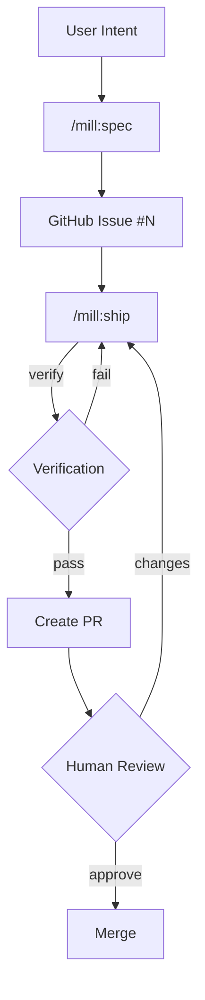

# mill

Turning intent into verified deliverables, continuously.

> **Branding:** Always "mill" in lowercase. Never "MILL" or "Mill".

## Overview

mill is a specification-first delivery system that integrates with Claude Code as a skill pack. It provides structure and intelligence for the entire delivery workflow.

### Two Components

1. **CLI** (`mill`) — Data operations, GitHub integration, structured output
2. **Skills** (`/mill:*`) — LLM-powered workflows invoked in Claude Code

## Architecture

```
mill/                           # Main repository (source of truth)
├── cli/                        # .NET CLI
├── skills/                     # Skill source files → synced to mill-plugin
├── plugin/                     # MCP installer → synced to mill-plugin
├── templates/                  # Spec/archetype/stack templates
└── prompts/                    # LLM prompts

mill-plugin/                    # Distribution repository (auto-synced)
├── .claude-plugin/             # Plugin manifest + marketplace
├── .mcp.json                   # MCP server config
├── skills/                     # Commands for Claude Code
└── plugin/mill-installer/      # Auto-installs CLI on plugin enable
```

## CLI Commands

```bash
mill init                           # Initialize .mill/ in current repo
mill ground list|get|create         # Knowledge CRUD (10 categories)
mill observations list|get          # Learning inbox (written by skills)
mill idea list|get|create|drop      # Idea lifecycle
mill draft list|get|validate|publish # Draft management + GitHub publish
mill issue list|get                 # Wraps gh CLI
mill history [add]                  # Ship run history
mill context [show]                 # View context.md
mill template list|get              # Archetypes/stacks/specs/domains
```

Output: JSON by default, `--human` for readable output.

## Domains

Specs include a `domain` field that determines execution guidance:

| Domain | Focus | Guidance |
|--------|-------|----------|
| `backend` | APIs, services, data | API design, error handling, performance |
| `application` | Interactive apps | Component architecture, state, UX |
| `website` | Pages (landing, marketing) | Aesthetics, responsive, performance |
| `platform` | Infrastructure, orchestration | IaC, containers, reliability, observability |
| `fullstack` | Multiple layers | Combined guidance |

Domain templates live in `templates/domains/` and are loaded by `/mill:ship` during execution.

## Skills

| Skill | Purpose |
|-------|---------|
| `/mill:ground` | Build product knowledge — personas, standards, concepts, design |
| `/mill:idea` | Capture ideas with 30-day lifecycle |
| `/mill:spec` | Transform intent into specs with Requirements (R) + Approach (A) → GitHub Issues |
| `/mill:ship` | Execute bounded work loops until verification passes |

Context generation (`_warmup.md`) runs automatically when `/mill:spec` or `/mill:ship` detect stale context.

## Observations

Observations is the **learning inbox** for mill. Skills write observations during execution. `/mill:ground` reviews and curates them into ground truth.

```
Skills (spec, ship, ground)
        │
        ▼ write .md files directly (no CLI)
.mill/observations/*.md
        │
        ▼ review via /mill:ground (AskUserQuestion)
.mill/ground/* (curated truth)
```

| Observation Type | Meaning |
|------------------|---------|
| `extraction` | Auto-extracted from code (dependencies, entities) |
| `discovery` | New information found (unknown persona, new term) |
| `concern` | Potential problem (missing tests, code smell) |
| `suggestion` | Improvement idea (refactoring opportunity) |

This continuous feedback loop is what sets mill apart — the system learns as you ship.

## Spec Structure

Specs link **what** → **how** → **proof**:

```
Requirements (R)     → what the solution must achieve
        ↓ implemented by
Approach (A)         → how we'll build it (parts + mechanisms)
        ↓ verified by
Criteria (C)         → testable conditions
```

**Coverage (R × A × C)** proves the chain: requirements have approach parts, and criteria verify them.

## Workflow



## Project Structure

```
.mill/                              # Target repo's mill folder
├── project.json                    # Global config
├── context.md                      # Auto-generated project context

├── observations/                   # Learning inbox [gitignored]
│   └── *.md                        # Written by skills during execution

├── ground/                         # Shared product knowledge (10 categories)
│   ├── strategic/                  # Vision, mission, goals
│   ├── personas/                   # Who you build for
│   ├── rules/                      # Constraints and conventions
│   ├── decisions/                  # Architectural decisions
│   ├── vocabulary/                 # Domain terminology
│   ├── stack/                      # Technology stack
│   ├── schema/                     # Data structures
│   ├── design/                     # Visual language
│   ├── patterns/                   # Code patterns
│   └── debt/                       # Technical debt

├── idea/
│   └── active/                     # Live briefs [gitignored]

├── spec/
│   └── drafts/                     # Specs before publishing [gitignored]

└── ship/
    ├── work/                       # Worktrees [gitignored]
    └── history.json                # Completed runs

# Published specs live in GitHub Issues (source of truth)
```

## Requirements

- Claude Code 1.0.33+
- `gh` CLI (GitHub CLI) — authenticated
- Node.js (for MCP installer)
- Git repository

## Installation

Install via Claude Code plugin (recommended):

```
/plugin marketplace add mindrevolution/mill-plugin
/plugin install mill@mindrevolution-mill-plugin
```

The CLI is auto-installed when the plugin is first enabled.

### CLI Only (without plugin)

```bash
# macOS / Linux
curl -fsSL https://raw.githubusercontent.com/mindrevolution/mill/main/install.sh | bash

# Windows
irm https://raw.githubusercontent.com/mindrevolution/mill/main/install.ps1 | iex
```

## Plugin Sync

The `mill-plugin` repo is auto-synced from `mill` on each release:

1. Release published on `mill` repo
2. GitHub Action (`sync-plugin.yml`) triggers
3. Copies `skills/`, `plugin/`, `.claude-plugin/`, `.mcp.json` to `mill-plugin`
4. Users get updates via plugin auto-update

## Development

```bash
# Build CLI
cd cli && dotnet build

# Run CLI
dotnet run -- --help
dotnet run -- init --human
dotnet run -- ground list --human
```

## Key Principles

1. **Specs drive execution** — GitHub Issues are source of truth
2. **Contracts over conversation** — No "done" without verification
3. **Bounded iterations** — Work in slices, verify after each
4. **Skills + CLI** — LLM for intelligence, CLI for structure
5. **Humans drive direction** — AI improves the code
