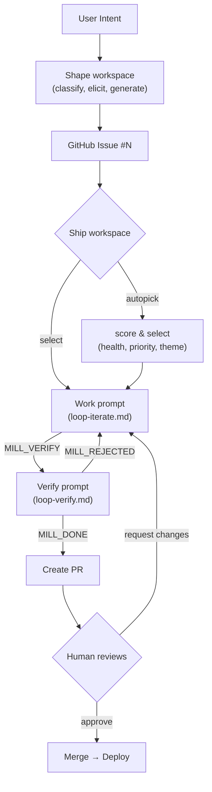
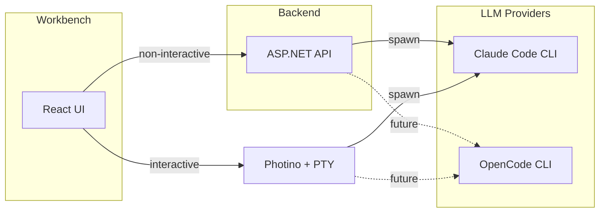

# mill

Turning intent into verified deliverables, continuously.

> **Branding:** Always "mill" in lowercase. Never "MILL" or "Mill".

> **Focus:** The Photino desktop app is the primary target. Web/container deployment will come later.

## Overview

mill is a specification-first delivery system with two main workflows:

1. **Spec Process** — Chat-to-spec: Transform user intent into complete, loop-ready specifications
2. **Work Loop** — Ralph-style execution: Bounded iteration until verification passes

## Structure

```
mill/
├── workbench/              # React UI (primary interface)
│   └── src/
├── api/                    # ASP.NET Minimal API (backend)
│   └── Mill.Api/
├── spec/                   # Spec creation (prompts + templates)
│   ├── prompts/
│   │   ├── context-warmup.md   # Generates .mill/context.md
│   │   ├── spec-draft.md       # Interactive spec elicitation
│   │   └── spec-refine.md      # Update spec against current codebase
│   └── templates/              # Spec output templates
│       ├── feature.md
│       ├── bug.md
│       ├── security.md
│       └── task.md
├── run/                    # Iterative execution
│   └── prompts/
│       ├── loop-iterate.md         # Work prompt (implement, signal MILL_VERIFY)
│       ├── loop-verify.md          # Verify prompt (review, approve/reject)
│       ├── loop-verify-criterion.md # Parallel: verify one criterion
│       └── run-autopick.md         # Intelligent issue selection
├── cli/                    # Deprecated
└── README.md

.mill/                              # Target repo's mill folder
├── project.json                    # Global config
├── context.md                      # Auto-generated project context

├── ground/                         # Shared product knowledge
│   ├── personas/                   # Who you build for
│   ├── standards/                  # How you build
│   ├── concepts/                   # Domain vocabulary
│   ├── design/                     # Visual language
│   └── observations.json           # AI-generated learnings, pending review

├── brief/
│   ├── active/                     # Live briefs (30-day time-box) [gitignored]
│   └── dropped.json                # Condensed essences of dropped ideas

├── shape/
│   └── drafts/                     # Specs before publishing [gitignored]

└── ship/
    ├── work/                       # Worktrees [gitignored]
    └── history.json                # Completed runs (includes git user)

# Completed specs live in GitHub Issues (single source of truth)
```

### What's in Git

The `.mill/` folder uses git as the collaboration layer. Shared knowledge is committed; personal WIP is gitignored.

**Committed (shared):**
- `project.json` — config
- `context.md` — kickstarts new clones
- `ground/` — all product knowledge (personas, standards, concepts, design, observations)
- `brief/dropped.json` — team knowledge of explored-but-dropped ideas
- `ship/history.json` — execution history with git usernames

**Gitignored (local WIP):**
- `brief/active/` — personal briefs in progress
- `shape/drafts/` — personal spec drafts before publishing
- `ship/work/` — ephemeral worktrees

```gitignore
# .mill gitignore
.mill/brief/active/
.mill/shape/drafts/
.mill/ship/work/
```

## Prompt File Naming

Format: `[subject]-[verb].md`

| File | Subject | Verb | Purpose |
|------|---------|------|---------|
| `context-warmup.md` | context | warmup | Build project context |
| `spec-draft.md` | spec | draft | Interactive spec elicitation with persistence |
| `spec-refine.md` | spec | refine | Update spec against current codebase |
| `loop-iterate.md` | loop | iterate | Work prompt — implement slice, signal MILL_VERIFY |
| `loop-verify.md` | loop | verify | Verify prompt — review work, approve or reject |
| `loop-verify-criterion.md` | loop | verify-criterion | Parallel verification — check one criterion |
| `run-autopick.md` | run | autopick | Intelligent issue selection |

Templates use noun form: `feature.md`, `bug.md`, `security.md`, `task.md`

## Workspaces

The workbench organizes work into four workspaces:

| Workspace | Purpose |
|-----------|---------|
| **Ground** | Build product knowledge — personas, standards, concepts, design |
| **Brief** | Capture ideas with intent — 30-day time-box |
| **Shape** | Refine into verified specs — publish to GitHub Issues |
| **Ship** | Execute bounded loops — until tests pass |

## Intent Types

| Type | Use When | Key Fields |
|------|----------|------------|
| **Feature** | New behavior or capability | User stories, acceptance criteria, scope |
| **Bug** | Existing behavior is broken | Reproduction steps, expected vs actual, regression test |
| **Security** | Risk, vulnerability, compliance | STRIDE category, attack vector, mitigation |
| **Task** | Technical work, no user-facing change | Rationale, scope, regression guardrails |

## Workflow



### Two-Prompt Verification

Work and verification are separated into distinct prompts:

1. **Work prompt** (`loop-iterate.md`) — Implements the slice, runs tests, signals `MILL_VERIFY` with metadata
2. **Verify prompt** (`loop-verify.md`) — Independent principal-engineer review, runs tests again, checks criteria, signals `MILL_DONE` or `MILL_REJECTED`

Only the verify prompt can authorize completion. The work prompt cannot grade its own homework.

### Criterion-Based Verification

Verification runs one agent per acceptance criterion:

1. **CLI runs tests once** (gate before criterion checks)
2. **Agents verify criteria in parallel** (up to 4 concurrent)
3. **Results aggregated** → `MILL_DONE` or `MILL_REJECTED` with specific failures

Benefits:
- Faster verification for complex specs
- Granular feedback (know exactly which criterion failed)
- Multiple independent reviewers strengthen "can't grade own homework"

**Note:** Specs without parseable criteria skip verification with a warning — fix the spec to include structured acceptance criteria.

## Requirements

- Claude Code CLI (or OpenCode in future)
- `gh` CLI (GitHub CLI) — authenticated
- Git repository

## Key Principles

1. **Model is source of truth** — Specs drive execution, not conversation
2. **Contracts over conversation** — No "done" without verification; work can't grade its own homework
3. **Limits are mandatory** — Bounded work prevents runaway loops
4. **Learning is explicit** — Memory improves the model, not the agent
5. **Hybrid worktree inheritance** — Config and standards are shared from parent; context and memory are per-worktree (rebuilt only if stale)
6. **Humans drive product direction** — Humans decide what gets built and when it ships; AI improves the code

## Architecture

The workbench is the primary interface. The CLI is deprecated.

```
mill/
├── workbench/     # React UI (primary interface)
├── api/           # ASP.NET Minimal API (backend)
├── spec/, run/    # Prompt templates
└── cli/           # Deprecated
```



### LLM Runtime

mill abstracts LLM execution behind a provider interface to support multiple CLI tools (Claude Code now, OpenCode planned).

| Mode | Path | Use Cases |
|------|------|-----------|
| **Non-interactive** | Workbench → API → CLI | Context warmup, verification, observations, autopick |
| **Interactive** | Workbench → Photino + PTY → CLI | Spec elicitation, work loops with user input |

**Non-interactive:** API spawns the CLI with `--print` flag, awaits completion, returns structured response. All prompts that don't require user input go this path.

**Interactive:** Photino hosts the React UI; Pty.Net spawns the CLI with full TTY support; xterm.js renders the terminal in-browser. Only used when the user needs to interact with the LLM session (e.g., answering clarifying questions during spec drafting).

### Provider Abstraction

The API uses a provider interface to abstract CLI differences:

```csharp
interface ILlmProvider
{
    Task<LlmResponse> Execute(string prompt, LlmOptions options);
    Process SpawnInteractive(string prompt); // for PTY
}
```

Implementations: `ClaudeCodeProvider`, `OpenCodeProvider` (future). The provider is selected via configuration, not hardcoded.

### Desktop Dependencies

| Component | Purpose | Package |
|-----------|---------|---------|
| Photino.NET | Native webview wrapper | `Photino.NET` |
| Pty.Net | Cross-platform PTY | `Pty.Net` |
| xterm.js | Terminal UI in browser | `@xterm/xterm` |

Photino IPC bridges React ↔ .NET directly (no WebSocket needed):

```csharp
// .NET → JS
window.SendWebMessage(ptyOutput);

// JS → .NET
window.RegisterWebMessageReceivedHandler((_, msg) => pty.Write(msg));
```

## Development Notes

- **Cross-platform:** Windows, Linux, macOS (x64/arm64) — use `OperatingSystem.IsWindows()` etc. for platform-specific code
- **Do not run `dotnet publish`** after each change — the user will build periodically when needed

## Documentation Standards

- **Diagrams must use Mermaid** — no ASCII art. Use fenced code blocks with `mermaid` language identifier.
- Keep markdown files concise and scannable

## Workbench UI

### Library Categories

The library organizes project knowledge into four categories. Each has a consistent color used across the UI (badges, icons, accents).

| Category | Color | Tailwind | Purpose |
|----------|-------|----------|---------|
| **Personas** | Blue | `blue-400`, `blue-500/15` | Who you build for |
| **Standards** | Emerald | `emerald-400`, `emerald-500/15` | How you build |
| **Concepts** | Violet | `violet-400`, `violet-500/15` | Domain vocabulary |
| **Design** | Pink | `pink-400`, `pink-500/15` | Visual language |

Usage pattern for badges:
```tsx
const categoryColors: Record<LibraryCategory, string> = {
  personas: 'bg-blue-500/15 text-blue-400',
  standards: 'bg-emerald-500/15 text-emerald-400',
  concepts: 'bg-violet-500/15 text-violet-400',
  design: 'bg-pink-500/15 text-pink-400',
}
```

### Accent Color

Primary accent is `#ffcc00` (yellow). Use sparingly for:
- Active/selected states
- Primary actions
- Key indicators (e.g., observations count in top bar)

Avoid overusing accent color — it should draw attention to what matters.
