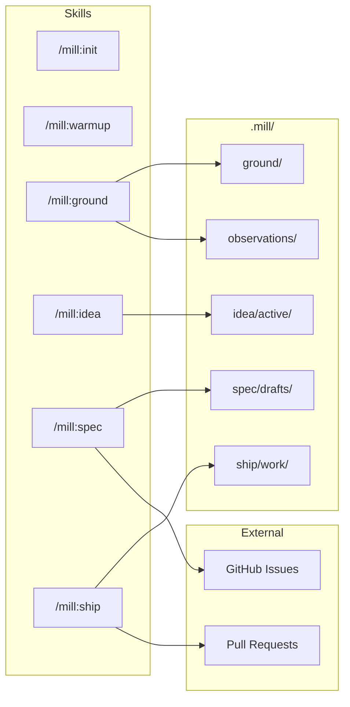
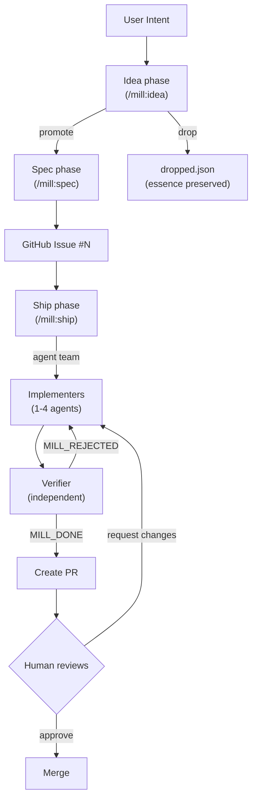
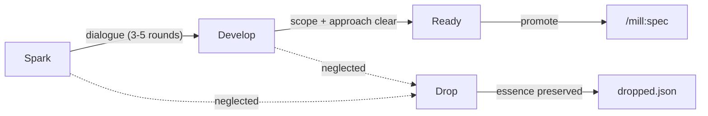

# mill

Turning intent into verified deliverables, continuously.

> **Branding:** Always "mill" in lowercase. Never "MILL" or "Mill".

## Overview

mill is a specification-first delivery system that runs as Claude Code skills. No desktop app, no web UI, no API server — just skills, prompts, and your git repository.

Two main workflows:

1. **Spec Process** — Chat-to-spec: Transform user intent into complete, loop-ready specifications
2. **Work Loop** — Agent team execution: Bounded iteration until verification passes

## Architecture

mill is a Claude Code skill pack. Skills are the interface; prompts are the engine; `.mill/` is the state.



### Dependencies

| Component | Purpose |
|-----------|---------|
| **Claude Code CLI** | Runtime — skills execute inside Claude Code sessions |
| **`gh` CLI** | GitHub integration — issues as published specs, PRs from ship |
| **git** | Collaboration layer — `.mill/` state syncs via git |

## Structure

```
mill/                               # Skill pack repo
├── ground/                         # Ground phase assets
│   ├── prompts/
│   │   └── kickstart.md
│   └── templates/
│       ├── archetypes/             # Product archetypes (saas, marketplace, etc.)
│       └── stacks/                 # Tech stack profiles (web-react-node, etc.)
├── shape/                          # Spec phase assets (legacy name in repo)
│   ├── prompts/
│   │   ├── spec-draft.md           # Interactive spec elicitation
│   │   ├── spec-refine.md          # Update spec against current codebase
│   │   └── context-warmup.md       # Generates .mill/context.md
│   └── templates/
│       ├── feature.md
│       ├── bug.md
│       ├── security.md
│       └── task.md
├── ship/                           # Ship phase assets
│   └── prompts/
│       ├── loop-iterate.md         # Work prompt (implement, signal MILL_VERIFY)
│       ├── loop-verify.md          # Verify prompt (review, approve/reject)
│       ├── loop-verify-criterion.md
│       ├── run-autopick.md         # Intelligent issue selection
│       └── run-observations.md     # Post-run learning extraction
└── brief/                          # Placeholder (ideas handled by /mill:idea skill)

.mill/                              # Per-repo state directory
├── context.md                      # Auto-generated project context
├── ground/                         # Product knowledge (committed, shared)
│   ├── strategic/
│   ├── personas/
│   ├── rules/
│   ├── decisions/
│   ├── vocabulary/
│   ├── stack/
│   ├── schema/
│   ├── design/
│   ├── patterns/
│   └── debt/
├── observations/                   # AI learning inbox (gitignored)
├── idea/
│   ├── active/                     # Ideas in progress (gitignored)
│   └── dropped.json                # Condensed essences of dropped ideas
├── spec/
│   └── drafts/                     # Specs before publishing (gitignored)
└── ship/
    └── work/                       # Worktrees (gitignored)

# Published specs live in GitHub Issues (single source of truth)
```

### What's in Git

`.mill/` uses git as the collaboration layer. Shared knowledge is committed; personal WIP is gitignored.

**Committed (shared):**
- `context.md` — kickstarts new clones
- `ground/` — all product knowledge
- `idea/dropped.json` — team knowledge of explored-but-dropped ideas

**Gitignored (local WIP):**
- `observations/` — learning inbox, reviewed via `/mill:ground`
- `idea/active/` — personal ideas in progress
- `spec/drafts/` — personal spec drafts before publishing
- `ship/work/` — ephemeral worktrees

## Phases

mill organizes work into four phases:

```
Ground → Idea → Spec → Ship
```

| Phase | Skill | Purpose |
|-------|-------|---------|
| **Ground** | `/mill:ground` | Build product knowledge — personas, rules, decisions, vocabulary, stack, patterns |
| **Idea** | `/mill:idea` | Capture ideas with intent — 30-day lifecycle, develop or drop |
| **Spec** | `/mill:spec` | Refine into verified specs — RAC framework, publish to GitHub Issues |
| **Ship** | `/mill:ship` | Execute as agent teams — bounded iteration until verification passes |

Two utility skills:

| Skill | Purpose |
|-------|---------|
| `/mill:init` | Initialize `.mill/` in a git repository |
| `/mill:warmup` | Orient Claude to the codebase — generate/refresh `.mill/context.md` |

## Intent Types

| Type | Use When | Key Fields |
|------|----------|------------|
| **Feature** | New behavior or capability | User stories, acceptance criteria, scope |
| **Bug** | Existing behavior is broken | Reproduction steps, expected vs actual, regression test |
| **Security** | Risk, vulnerability, compliance | STRIDE category, attack vector, mitigation |
| **Task** | Technical work, no user-facing change | Rationale, scope, regression guardrails |

## Workflow



### Spec Process (RAC Framework)

Specs use a Requirements-Approach-Criteria framework:

- **Requirements (R)** — what the solution must achieve
- **Approach (A)** — how we'll build it (parts + mechanisms)
- **Criteria (C)** — testable verification conditions
- **Coverage (R x A x C)** — proof chain: approach implements requirements, criteria verify them

Feature and task specs require **at least 2 approaches** before choosing one. Rejected approaches are preserved in a collapsed "Alternatives Considered" section.

Quality gates:
1. **Self-review** — 5 dimensions scored 1-10 (Feasibility, Completeness, Scope Discipline, Testability, Clarity). All must be ≥ 7.
2. **Independent spec review** — a subagent reviews the spec without seeing the drafting conversation.
3. **User approval** — explicit approval required before publishing to GitHub Issues.

### Domain Classification

Every spec is classified by domain, which loads domain-specific guidance during Ship:

| Domain | Focus |
|--------|-------|
| `backend` | APIs, services, data layer |
| `application` | Interactive apps (web, mobile, desktop) |
| `website` | Pages (landing, marketing, content) |
| `platform` | Infrastructure, containers, CI/CD |
| `fullstack` | Multiple layers |

### Agent Team Execution

Ship runs specs as agent teams. The lead orchestrates; implementers and verifier are separate agents.

| Approach Parts | Team Size |
|----------------|-----------|
| 1–4 | 1 implementer |
| 5–9 (single domain) | 2 implementers (split by concern) |
| Any (fullstack) | 2–3 implementers (one per layer) |
| 10+ | 3–4 implementers |

Always +1 independent verifier. The verifier receives clean context — never saw the implementation reasoning.

### Two-Prompt Verification

Work and verification are separated into distinct agents:

1. **Implementers** — implement slices, commit, run tests
2. **Verifier** — independent principal-engineer review, runs tests again, checks each criterion

Only the verifier can authorize completion. Implementers cannot grade their own homework.

### Signals

Machine-readable signals flow between agents:

| Signal | Emitted By | Meaning |
|--------|-----------|---------|
| `MILL_CONTINUE` | Implementer | More slices remain |
| `MILL_VERIFY` | Implementer | Ready for verification |
| `MILL_DONE` | Verifier | All criteria met, create PR |
| `MILL_REJECTED` | Verifier | Criteria not met, iterate with feedback |
| `MILL_ABORT` | Implementer | Spec is invalid or impossible |

### Learning Loop

After each ship run, the lead extracts non-obvious learnings into observations:

```
Ship → Observations → /mill:ground review → Ground knowledge → better specs → better shipping
```

Observations are routed with `suggested:` hints (e.g., `ground/patterns/`, `ground/rules/`) but humans decide final placement via `/mill:ground`.

## Ground Knowledge Categories

| Category | Purpose |
|----------|---------|
| **strategic** | Vision, mission, goals |
| **personas** | Who you build for |
| **rules** | Constraints and conventions |
| **decisions** | Architectural decisions (why X over Y) |
| **vocabulary** | Domain terminology |
| **stack** | Technology stack |
| **schema** | Data structures and relationships |
| **design** | Visual language (colors, typography) |
| **patterns** | Code patterns and idioms |
| **debt** | Known issues, future work |

## Idea Lifecycle

Ideas have a 30-day window to mature or get dropped:



**Dropped ideas** get condensed to a single sentence — a searchable log of "whys that didn't survive," not a backlog to manage.

## Key Principles

1. **Model is source of truth** — Specs drive execution, not conversation
2. **Contracts over conversation** — No "done" without verification; work can't grade its own homework
3. **Limits are mandatory** — Bounded work prevents runaway loops
4. **Learning is explicit** — Observations improve the model, not the agent
5. **Humans drive product direction** — Humans decide what gets built and when it ships; AI improves the code

## Prompt and Template Organization

Prompts and templates are organized by phase:

```
{phase}/
├── prompts/       # LLM prompts
└── templates/     # Output templates (if applicable)
```

### Prompt Naming

Format: `[subject]-[verb].md`

| Phase | File | Purpose |
|-------|------|---------|
| shape | `context-warmup.md` | Build project context |
| shape | `spec-draft.md` | Interactive spec elicitation |
| shape | `spec-refine.md` | Update spec against current codebase |
| ship | `loop-iterate.md` | Work prompt — implement, signal MILL_VERIFY |
| ship | `loop-verify.md` | Verify prompt — review, approve/reject |
| ship | `loop-verify-criterion.md` | Parallel verification — check one criterion |
| ship | `run-autopick.md` | Intelligent issue selection |
| ship | `run-observations.md` | Post-run learning extraction |
| ground | `kickstart.md` | Generate initial ground files |

### Templates

Templates use noun form and live under `{phase}/templates/`:
- `shape/templates/` — spec output: `feature.md`, `bug.md`, `security.md`, `task.md`
- `ground/templates/archetypes/` — product archetypes: `saas.md`, `marketplace.md`, etc.
- `ground/templates/stacks/` — tech stack profiles: `web-react-node.md`, etc.

## Documentation Standards

- **Diagrams must use Mermaid** — no ASCII art
- Keep markdown files concise and scannable
