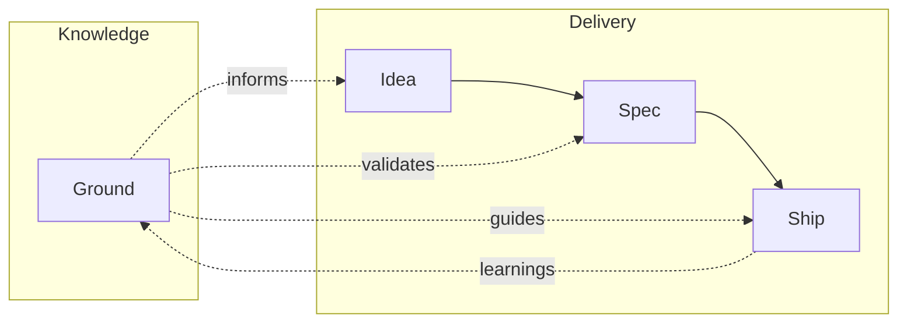

# mill

Think it through. Ship it right. Sharper every cycle.

mill works with Claude Code to help you think through what you want to build — asking the right questions before anyone writes code. Then it implements in verified steps. With every cycle, mill learns about your project: your conventions, your architecture, your domain. The more you ship, the sharper it gets.

## Quick Start

### Install

```
/plugin marketplace add mindrevolution/claude-plugins
/plugin install mill@mindrevolution
```

### Initialize

```
/mill:init
```

### Use in Claude Code

```
/mill:spec               # Think through what to build
/mill:ship 42            # Implement and verify issue #42
```

## How It Works



| Skill | What you get |
|-------|-------------|
| `/mill:init` | Initialize mill in your project |
| `/mill:ground` | Your project's knowledge base — personas, conventions, architecture |
| `/mill:idea` | Capture a rough thought — 30 days to develop or drop |
| `/mill:spec` | Think through your intent → GitHub Issue |
| `/mill:ship` | Assemble a team, implement, verify → Pull Request |
| `/mill:warmup` | Orient mill to your codebase (usually automatic) |

Every cycle feeds learnings back — patterns found, decisions made, gaps noticed. You review. The next cycle starts smarter.

## Requirements

- Claude Code
- `gh` CLI (authenticated)
- Git repository on GitHub

## Documentation

See [AGENTS.md](AGENTS.md) for full documentation.

## License

[MIT](https://opensource.org/licenses/MIT)
