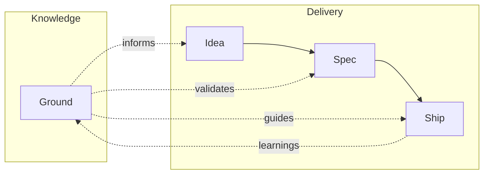

# mill

Think it through. Ship it right. Sharper every cycle.

mill works with Claude Code to help you think through what you want to build — asking the right questions before anyone writes code. Then it implements in verified steps. With every cycle, mill learns about your project: your conventions, your architecture, your domain. The more you ship, the sharper it gets.

## Quick Start

### Install

```bash
# macOS / Linux
curl -fsSL https://raw.githubusercontent.com/mindrevolution/mill/main/install.sh | bash

# Windows
irm https://raw.githubusercontent.com/mindrevolution/mill/main/install.ps1 | iex
```

### Initialize

```bash
cd your-project
mill init
```

### Use in Claude Code

```
/mill:warmup              # Let mill learn your codebase
/mill:spec               # Think through what to build
/mill:ship 42             # Implement and verify issue #42
```

## How It Works

mill adds a thinking and learning layer to Claude Code through **skills** (interactive workflows) and a **CLI** (data operations and GitHub integration).

### Workflow



| | |
|-|-|
| **Ground** | What mill knows about your project — personas, conventions, architecture |
| **Idea** | A rough thought with a 30-day time-box — develop it or drop it |
| **Spec** | Your intent, refined into clear requirements and testable criteria |
| **Ship** | Verified implementation — bounded loops until criteria pass |

The arrow from Ship back to Ground is the learning loop. Observations from each cycle feed into your project's knowledge base, making the next cycle better.

### Skills

| Skill | Purpose |
|-------|---------|
| `/mill:ground` | Build and review project knowledge |
| `/mill:idea` | Capture a rough idea (30-day lifecycle) |
| `/mill:spec` | Think through your intent → GitHub Issue |
| `/mill:ship` | Implement with verification → Pull Request |
| `/mill:warmup` | Orient mill to your codebase |

### CLI

```bash
mill init                    # Initialize .mill/
mill ground list --human     # List project knowledge
mill draft list --human      # List spec drafts
mill issue list --human      # List GitHub issues
mill history --human         # View ship history
```

## Requirements

- Claude Code
- `gh` CLI (authenticated)
- Git repository on GitHub

## Documentation

See [AGENTS.md](AGENTS.md) for full documentation.

## License

[MIT](https://opensource.org/licenses/MIT)
