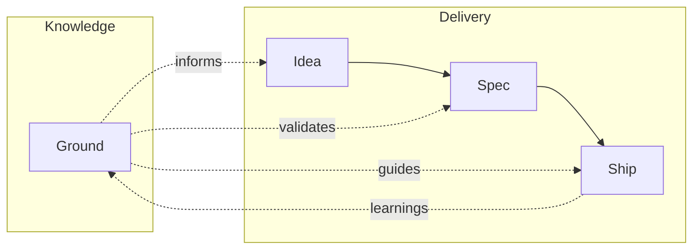

# mill

Think it through. Ship it right. Sharper every cycle.

mill is a skill pack for [Claude Code](https://docs.anthropic.com/en/docs/claude-code) that brings structure to AI-assisted software delivery. Markdown skills orchestrate Claude Code's native tools to manage the full workflow — from intent to verified Pull Request.

You describe intent. mill asks the right questions, writes a complete spec, assembles a team of agents, implements in verified steps, and opens a PR. Every cycle feeds learnings back into your project's knowledge base. The more you ship, the sharper it gets.

## Quick Start

```
/plugin marketplace add mindrevolution/mill
/plugin install mill@mindrevolution
```

Then in your project:

```
/mill:init                # Set up .mill/ directory
/mill:spec                # Think through what to build → GitHub Issue
/mill:ship 42             # Assemble team, implement, verify → PR
```

## How It Works



| Skill | What it does |
|-------|-------------|
| `/mill:init` | Initialize `.mill/` — directory structure, config, templates |
| `/mill:ground` | Build your project's knowledge base — personas, conventions, decisions |
| `/mill:idea` | Capture a rough thought — 30 days to develop into a spec or drop with learnings |
| `/mill:spec` | Turn intent into a precise, self-contained spec → published as GitHub Issue |
| `/mill:ship` | Assemble a team of agents, implement a spec, verify independently → PR |
| `/mill:warmup` | Orient Claude to your codebase — architecture, patterns, recent changes |

## Agent Teams

When you `/mill:ship`, mill doesn't just generate code in a single pass. It assembles a team:

1. **Lead** — reads the spec, determines team size, delegates work, manages cross-team contracts
2. **Implementer(s)** — 1-4 agents with explicit file ownership boundaries, working in parallel where possible
3. **Verifier** — a separate agent with clean context that reviews the full changeset against every spec criterion

The verifier never sees the implementer's reasoning. This structural independence catches what self-review misses.

## The Learning Loop

Every skill writes observations — patterns discovered, gaps noticed, conventions found. `/mill:ground` curates these into permanent project knowledge: personas, rules, vocabulary, architectural decisions. The next spec is informed by what the last ship learned.

## Requirements

- [Claude Code](https://docs.anthropic.com/en/docs/claude-code)
- `gh` CLI ([GitHub CLI](https://cli.github.com/)) — authenticated
- Git repository on GitHub

## Documentation

See [AGENTS.md](AGENTS.md) for the full reference — architecture, project structure, skill details, and development guide.

## License

[MIT](https://opensource.org/licenses/MIT)
