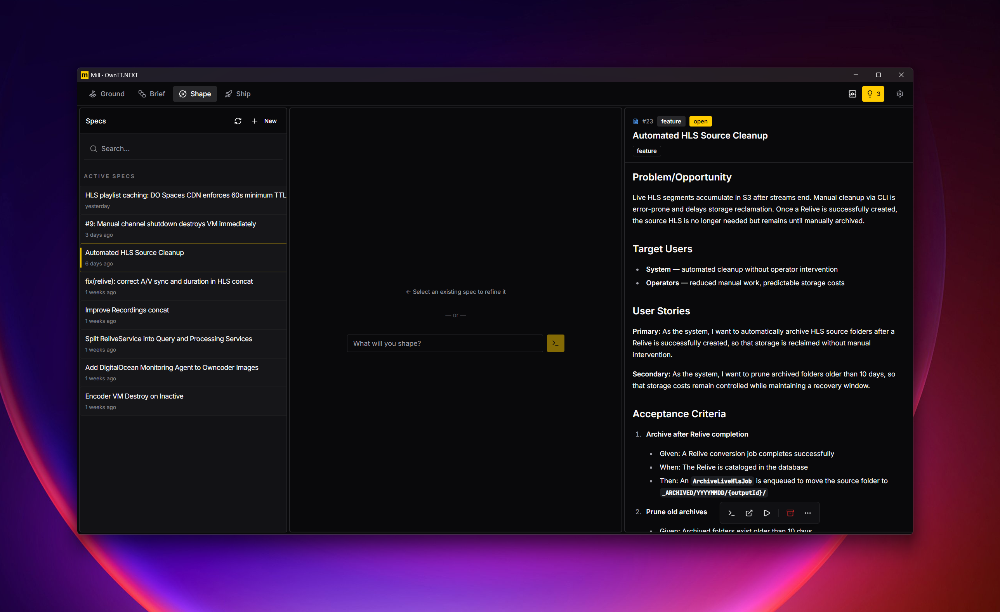
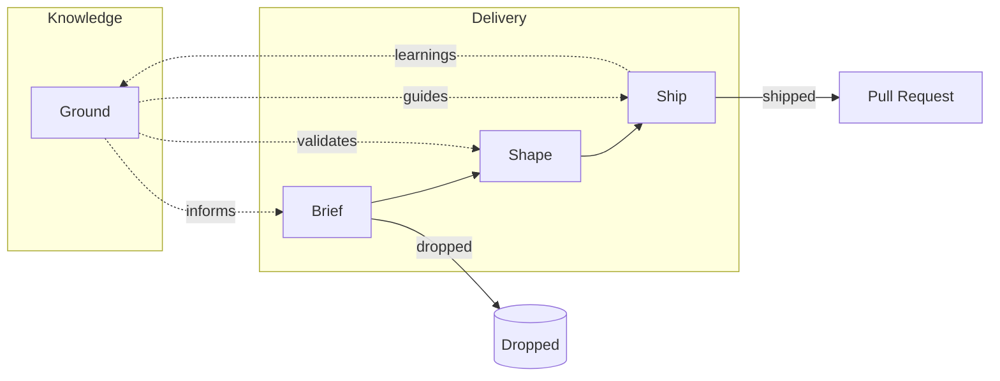
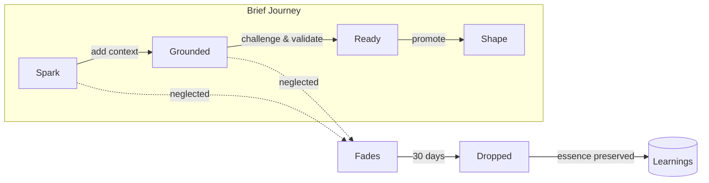

# mill

**Knowledge-first AI delivery.** mill turns product knowledge into an active delivery system — so AI output stays coherent as products evolve.



## Why mill?

Instead of starting with prompts or code, mill builds and maintains project ground — personas, standards, constraints, and concepts — and uses that shared understanding to continuously shape well-verified specs and execute them in bounded, test-driven loops.

mill is not a code generator. It is the layer that makes AI behave like it understands the product.

## How It Works



| | |
|-|-|
| **Ground** | Build product knowledge — personas, standards, concepts; review AI observations |
| **Brief** | Capture ideas with intent — what and why; validate against Ground; 30-day time-box |
| **Shape** | Refine into verified specs — chat-to-spec elicitation; publish to GitHub Issues |
| **Ship** | Execute in bounded loops — until tests pass; review PRs |

## The Brief Lifecycle

Briefs have a 30-day window to mature or get dropped. No endless backlog.



**Visual decay:** Fresh briefs appear solid; aging briefs fade in opacity. No alarm colors — just natural fading like paper yellowing. The absence of vibrancy signals age.

**Dropped ideas** get condensed to a single sentence — a searchable log of "whys that didn't survive," not a backlog to manage.

## Loop Contract

Every spec includes a verifiable contract:

```markdown
## Loop Contract
- Success Criteria: <machine-checkable>
- Test Command: <must pass before PR>
- Stop Conditions: <max iterations>
```

The contract decides completion, not the agent.

## Spec Types

| Type | When | Verified By |
|------|------|-------------|
| **Feature** | New capability | Acceptance criteria |
| **Bug** | Broken behavior | Regression test |
| **Security** | Vulnerability | Threat mitigated |
| **Task** | Technical work | Criteria pass |

## Who It's For

- Solo builders who want leverage without losing control
- Small teams (2–10) shipping real products under time pressure
- Founders and PM-engineers who own product intent end-to-end
- AI-forward developers using multiple models across tools

Not built for enterprise. Low ceremony, high velocity. For teams who spend their energy on customers, not on managing themselves.

## Collaboration

mill uses your git repository as the sync layer — no separate backend, no accounts.

- **Product knowledge** syncs via git
- **Specs** publish to GitHub Issues
- **PRs** come from Ship when tests pass
- **History** shows what you achieved

Personal work-in-progress (active briefs, draft specs) stays local until ready to share.

## Requirements

- [Claude Code](https://claude.ai/code)
- Git repository on GitHub
- `gh` CLI (authenticated)
- Windows, Linux or macOS

OpenCode and GitLab support are next — ironing out the core first.

## License

[MIT](https://opensource.org/licenses/MIT)
