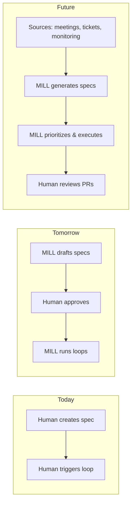

# MILL

**Turning intent into verified deliverables, continuously.**

MILL turns conversations into specifications, then executes them in bounded loops until verification passes — not until the AI thinks it's done.

```
Chat → Spec → Contract → Loop → Verify → Learn
```

## Core Idea

The system doesn't "get smarter" implicitly. The **model gets better explicitly.**

- Ambiguous intent → explicit, verifiable specification
- Specification includes a **Loop Contract** with success criteria
- Execution runs in bounded iterations until criteria pass
- Verified learnings feed back into project memory

**Key insight:** Keep work in a controlled loop until *objective criteria* are met.

## Trajectory: Toward Autonomous Operation

MILL is designed to evolve from human-driven to fully autonomous.



**The end state:**
- MILL ingests work from multiple sources (meeting notes, support tickets, monitoring alerts)
- MILL drafts specifications autonomously
- MILL prioritizes and executes without prompting
- Humans shift from *operators* to *supervisors* — reviewing, approving, intervening when needed

**Why incremental:**
- Each step validates assumptions before building the next
- Human-in-the-loop today teaches MILL what good specs look like
- Manual triggers today become automatic triggers tomorrow
- The contracts and verification we build now are the foundation for trust in autonomous execution

**Current phase:** Human-driven spec creation and loop execution, with structured contracts that will enable future automation.

## The Merge Gate

Even at full autonomy, **humans own the merge button**.

> A well-governed system preserves human ownership of the merge button while raising the baseline quality of every PR.

Shipping affects the whole organization — support, marketing, customers. The merge decision is "is everyone ready?", not just "is the code ready?"

MILL automates everything *up to* the merge. Humans control the flow.

## Loop Contract

Every spec includes a contract that defines "done":

```markdown
## Loop Contract
- Success Criteria: <machine-checkable>
- Test Command: <required — must pass before PR>
- Verification Commands: <additional checks>
- Completion Promise: MILL_DONE
- Stop Conditions: <max iterations>
```

The contract decides completion, not the agent. **No PR without passing tests.**

## Quick Start

```bash
# 1. Initialize repo (once)
mill init

# 2. Create spec (interactive)
mill spec                     # → outputs: created: #42

# 3. List available issues
mill run

# 4. Autopick best issue (checks health, scores by priority + theme)
mill run --auto

# 5. Or pick specific issue
mill run #42                  # runs in isolated worktree, cleans up after
```

## Commands

| Command | Purpose |
|---------|---------|
| `mill init` | Initialize repo (labels, directories, config, AGENTS.md, context) |
| `mill spec` | Interactive spec creation → GitHub issue |
| `mill run` | List available issues (sorted by impact) |
| `mill run --auto` | Autopick: health check, score candidates, recommend best issue |
| `mill run #N` | Execute work loop on issue |

**Guards:** Loop won't run if issue is closed, `in-progress`, `blocked`, or `ready-for-review`.

**Re-init:** Running `mill init` on an existing setup prompts for confirmation, then regenerates context.

## Intent Types

| Type | When | Verified by |
|------|------|-------------|
| **Feature** | New capability | Acceptance criteria pass |
| **Bug** | Broken behavior | Failing test passes |
| **Security** | Risk/vulnerability | Threat mitigated |
| **Task** | Technical work, no user change | Criteria pass, no regressions |

## GitHub Integration

**Labels** (created by `mill init`, managed automatically):
- `in-progress` — loop is working
- `blocked` — needs human input
- `ready-for-review` — loop completed

On success, creates PR with `Fixes #N` (use branch protection for review requirements).

## Directory Structure

```
AGENTS.md            # Project instructions (cross-tool standard)
CLAUDE.md            # Shim (@AGENTS.md) for Claude Code
.mill/
├── config.json      # Project configuration (scoring, excludes)
├── context.md       # Auto-generated project context
├── memory/          # Machine-generated learnings
├── drafts/          # In-progress specs
├── standards/       # Human-authored rules
└── work/            # Worktrees (gitignored, ephemeral)
```

**Worktree inheritance:** Config and standards are read from the parent repo (project-level). Context and memory are per-worktree (isolated). Context is only rebuilt if stale or missing.

Completed specs live in GitHub Issues (single source of truth).

## Requirements

- Git repo + `gh` CLI (authenticated)

**Optional env vars:** `MILL_CLI` (default: claude), `MILL_HOME`, `MILL_MAX_ITERATIONS` (default: 20)

## License

[MIT](https://opensource.org/licenses/MIT) — use, modify, distribute freely. Keep the copyright notice.
