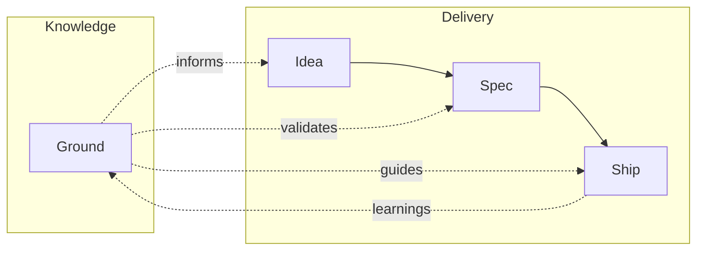

# mill

Think it through. Ship it right. Sharper every cycle.

mill works with Claude Code to help you think through what you want to build — asking the right questions before anyone writes code. Then it implements in verified steps. With every cycle, mill learns about your project: your conventions, your architecture, your domain. The more you ship, the sharper it gets.

## Quick Start

### Install

```bash
# macOS / Linux
curl -fsSL https://raw.githubusercontent.com/mindrevolution/mill/main/install.sh | bash

# Windows
irm https://raw.githubusercontent.com/mindrevolution/mill/main/install.ps1 | iex
```

### Initialize

```bash
cd your-project
mill init
```

### Use in Claude Code

```
/mill:spec               # Think through what to build
/mill:ship 42             # Implement and verify issue #42
```

## How It Works



| Skill | What you get |
|-------|-------------|
| `/mill:ground` | Your project's knowledge base — personas, conventions, architecture |
| `/mill:idea` | Capture a rough thought — 30 days to develop or drop |
| `/mill:spec` | Think through your intent → GitHub Issue |
| `/mill:ship` | Pre-flight → `mill ship` → Pull Request |
| `/mill:warmup` | Orient mill to your codebase |

Every cycle feeds learnings back — patterns found, decisions made, gaps noticed. You review. The next cycle starts smarter.

### CLI

```bash
mill init                    # Initialize .mill/
mill ground list --human     # Project knowledge
mill draft list --human      # Spec drafts
mill spec list --human       # Published specs (GitHub issues)
mill ship 42 --human         # Implement spec #42 (worktree + iterations + PR)
mill history --human         # Ship history
```

## Requirements

- Claude Code
- `gh` CLI (authenticated)
- Git repository on GitHub

## Documentation

See [AGENTS.md](AGENTS.md) for full documentation.

## License

[MIT](https://opensource.org/licenses/MIT)
