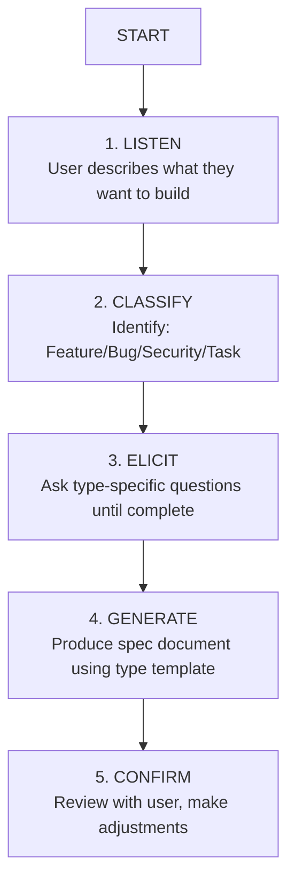

# Spec

Create a complete, loop-ready specification through guided conversation.

## Overview

This command guides you through creating a specification by:
1. Understanding your intent through conversation
2. Classifying the type (Feature, Bug, Security, or Task)
3. Asking type-specific questions to gather requirements
4. Generating a complete spec document

## Workflow

## Classification Rules

| Signal | Type |
|--------|------|
| Security/vulnerability/risk mentioned | **Security** (always) |
| Existing behavior is broken/wrong | **Bug** |
| New user-facing capability | **Feature** |
| Technical work, no user-facing change | **Task** |

## Behavior

### Phase 1: Listen
Start with an open prompt:
> "What would you like to build? Tell me about it in your own words."

Let the user talk. Don't interrupt with questions yet. Gather initial context.

### Phase 2: Classify
After understanding the intent, state your classification:
> "This sounds like a **Feature** — you're adding new capability for [X]. Does that match your intent?"

If unclear, ask:
> "I want to make sure I classify this correctly. Is this:
> - A new capability (Feature)
> - Something that's broken (Bug)
> - A security concern (Security)
> - Technical work with no user-facing change (Task)"

### Phase 3: Elicit
Load the appropriate elicitation prompt:
- Feature → `prompts/elicit-feature.md`
- Bug → `prompts/elicit-bug.md`
- Security → `prompts/elicit-security.md`
- Task → `prompts/elicit-task.md`

Ask questions one at a time. Build understanding incrementally. Don't overwhelm.

### Phase 4: Generate
When you have enough information, say:
> "I have enough to draft the spec. Generating now..."

Use the appropriate template:
- Feature → `templates/feature.md`
- Bug → `templates/bug.md`
- Security → `templates/security.md`
- Task → `templates/task.md`

Fill in all fields. Leave nothing as placeholder.

### Phase 5: Confirm
Present the spec and ask:
> "Here's the draft spec. Please review:
> - Are the acceptance criteria correct?
> - Is the scope right?
> - Anything missing?
>
> I can adjust before we finalize."

## Output

Write the spec to: `spec/{type}/{slug}.md`

Example paths:
- `spec/feature/user-invitations.md`
- `spec/bug/login-button-mobile.md`
- `spec/security/api-rate-limiting.md`
- `spec/task/upgrade-node-20.md`

## Completion

When the spec is written and confirmed:
> "Spec created: `spec/{type}/{slug}.md`
>
> Next steps:
> - Review the Loop Contract
> - Run `/implement {slug}` to start the work loop"

## Rules

- Never skip the elicitation phase
- Never generate a spec with placeholder values
- Always confirm classification with the user
- Push back on vague requirements
- If security is involved, it's always a Security spec
- One spec per conversation (don't combine multiple issues)

## Input

USER_PROMPT:
{{USER_PROMPT}}
